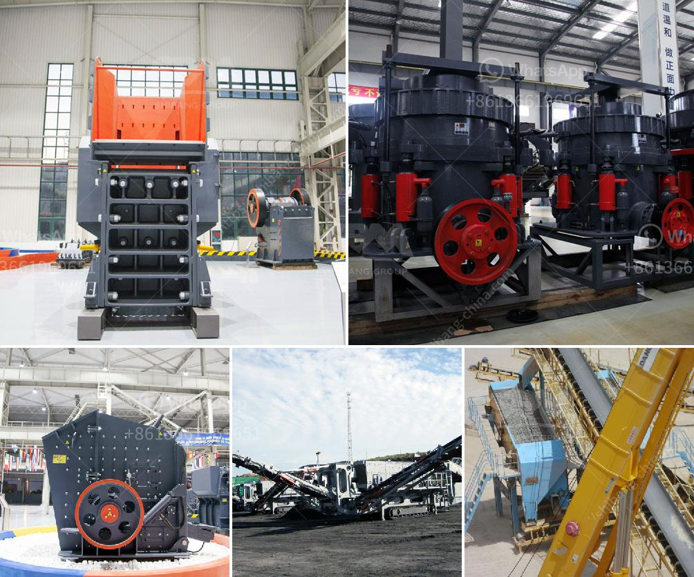

<h3>list of quarry operators in uae</h3>
The United Arab Emirates (UAE) boasts a diverse range of quarry operators, serving the nation's construction industry. Many of these operators have a long-standing presence in the UAE, providing various types of aggregates such as limestone, gravel, and sand for both domestic and international projects.

One prominent quarry operator in the UAE is Stevin Rock. With over four decades of experience, Stevin Rock has become a leading producer of construction aggregates, including armor rocks, crushed sand, and gabion rocks. They operate three large-scale quarries in Ras Al Khaimah and produce over 60 million tons of material annually.

Another notable quarry operator is Qatar Quarry Company. This company has two quarries, one in Fujairah and another in Al Taween, Ras Al Khaimah. They offer a wide range of quarry products, including crushed gravel, washed sand, and gabbro aggregates.

RAK Rock is yet another prominent quarry operator in the UAE. They specialize in producing high-quality limestone aggregates for various construction applications. RAK Rock operates two quarries - one in Al Ghail, Ras Al Khaimah, and another in Khor Khwair, in Ras Al Khaimah's industrial zone.

Gulf Rock is a leading quarry operator offering a comprehensive range of products, including crushed aggregates, washed sand, and rock armor. They have multiple quarries across the UAE, including sites in Fujairah, Ras Al Khaimah, and Abu Dhabi.

These are just a few examples of the quarry operators in the UAE. Each operator has its own unique offering, whether it's the type of material produced or the location of their quarries. The presence of such a diverse range of operators in the UAE is a testament to the nation's thriving construction industry and its ongoing commitment to infrastructure development.
<h3>Contact us</h3><ul><li><strong>Whatsapp:&nbsp;<a href="https://wa.me/8613661969651">+8613661969651</a></strong></li><li><a href="https://swt.shibang-china.com/?git&amp;zhl&amp;list of quarry operators in uae"><strong>Online Service(chat now)</strong></a></li></ul><h3>Related</h3><ul><li><a href='gold wash plant at south africa gold mine.md'>gold wash plant at south africa gold mine</a></li><li><a href='basic process in producing clay products.md'>basic process in producing clay products</a></li><li><a href='saudi arabia crusher plant.md'>saudi arabia crusher plant</a></li><li><a href='what is the best granite crusher machine.md'>what is the best granite crusher machine</a></li><li><a href='mobile crushers manufactureres in china.md'>mobile crushers manufactureres in china</a></li></ul>