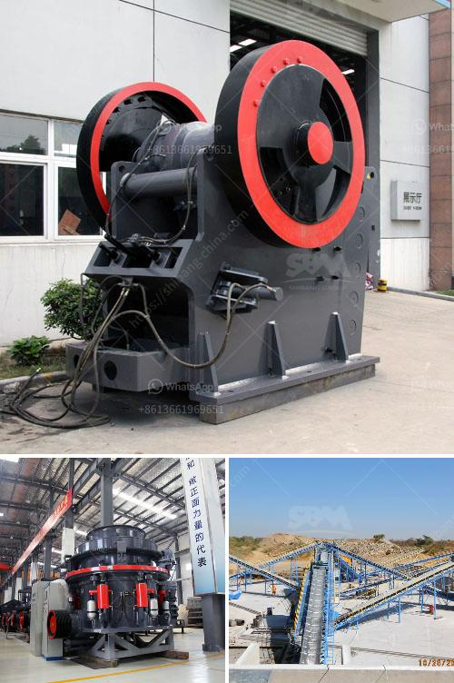

<h3>list of stone crushers in odisha</h3>
A stone crusher is a machine designed to reduce large rocks into smaller rocks, gravel, or rock dust. Crushers may be used to reduce the size, or change the form, of waste materials so they can be more easily disposed of or recycled, or to reduce the size of a solid mix of raw materials (as in rock ore), so that pieces of different composition can be differentiated. Crushing is the process of transferring a force amplified by mechanical advantage through a material made of molecules that bond together more strongly, and resist deformation more, than those in the material being crushed do.

In Odisha, stone crushers have increased in number and now more units are operating in different districts. Construction of roads, bridges, buildings, canals, etc., is the driving force behind the stone crusher industry. Currently, most of the stone crusher units in Odisha are found in the districts of Khurda, Cuttack, Sundargarh, and Jajpur.

Odisha has abundant natural resources and a large coastline. With a rapidly growing infrastructure, Odisha is fast-emerging as a key player in the industrial development of the country. Important industries in the state include steel, power, telecommunications, chemicals, and engineering. The state also has a booming tourism industry, owing to its rich cultural heritage and natural beauty.

Stone crushing is an important part of many industrial activities such as construction, landscaping, road building, and demolition. According to research, the total projected demand for construction aggregates in Odisha is 107.2 million tons by 2021-22, with a cumulative growth rate of over 7%. The extensive deposits of granite, basalt, and river sand in the state have provided a huge resource base for the stone crushing industry.

Odisha is an emerging state. In terms of infrastructure development and construction, it ranks among the top in the country. With ongoing mega projects like the Paradip Port expansion, the Khurda-Balangir rail link, and the upcoming Smart City projects in Bhubaneswar and Puri, the demand for stone aggregates is expected to increase significantly.

To meet the growing demand for stone aggregates, Odisha's stone crusher industry is currently on a hiring spree. With the ongoing economic boom, the state is seeing the rapid expansion of mini stone crushing units. These units are small-scale and mostly operated by individuals or small groups.

Despite the challenges faced by the stone crusher industry, such as regulatory measures and stiff competition from illegal crusher units, the industry is growing at a healthy pace. The stone crushers in Odisha are located in the districts of Khurda, Cuttack, Sundargarh, and Jajpur. The stone crushers are mainly operated by the individuals and small scale industries in Odisha.

It is found that the overall economic coefficient of the stone crushers in Odisha is high, and the scientific design of the crushing process ensures smooth running and reliable operation, which reduces the wear and tear on the equipment and prolongs the service life. Compared with the traditional stone crushers in the market, the modernized versions have pursued efficient productivity and environmental benefits.

In conclusion, the stone crushing industry in Odisha is growing at a rapid pace and is expected to attain a desired size within the next few years. The state's infrastructure development projects are likely to add to the demand for stone aggregates, making it a lucrative venture for both individuals and small-scale businesses. However, it is crucial that the industry adheres to all necessary regulations and environmental standards to ensure sustainable growth.
<h3>Contact us</h3><ul><li><strong>Whatsapp:&nbsp;<a href="https://wa.me/8613661969651">+8613661969651</a></strong></li><li><a href="https://swt.shibang-china.com/?git&amp;zhl&amp;list of stone crushers in odisha"><strong>Online Service(chat now)</strong></a></li></ul><h3>Related</h3><ul><li><a href='conveyor belts for shelves.md'>conveyor belts for shelves</a></li><li><a href='how much does it cost to set up a mini cement plant.md'>how much does it cost to set up a mini cement plant</a></li><li><a href='quartz bulk supplier sri lanka.md'>quartz bulk supplier sri lanka</a></li><li><a href='difference between pebble and stone.md'>difference between pebble and stone</a></li><li><a href='course in maintenance of stone crushers.md'>course in maintenance of stone crushers</a></li></ul>