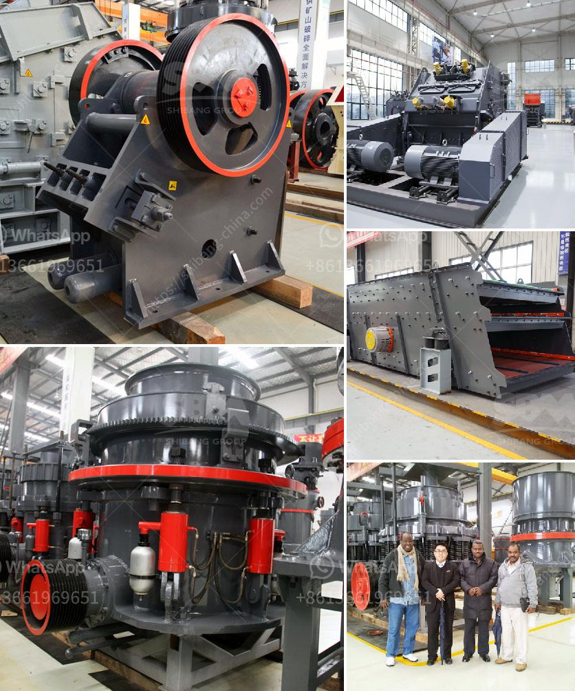

<h3>lister grinding mill in kenya</h3>
The lister grinding mill is a multi-purpose grinding machine designed to efficiently grind a variety of grains and pulses. The machine’s exclusive design enables the operator to easily control the grinding process, ensuring a smooth and consistent flow of grains. With its powerful motor and sturdy construction, the lister grinding mill can withstand heavy-duty use and deliver excellent grinding results.

One of the primary advantages of the lister grinding mill is its versatility. This machine can grind a wide range of grains, including maize, wheat, barley, sorghum, and rice, among others. It is also capable of grinding pulses like lentils and beans. The ability to work with various grains and pulses makes the lister grinding mill an indispensable tool for farmers and small-scale millers across Kenya.

The lister grinding mill is known for its remarkable performance and consistency. Its powerful motor ensures high-speed grinding, which significantly reduces the time required for grinding large quantities of grain. The machine’s sturdy construction and robust design guarantee durability and long-lasting performance, even under heavy usage. With minimal maintenance requirements, the lister grinding mill is a reliable and cost-effective solution for grinding grain.

In addition to its performance and versatility, the lister grinding mill is also highly efficient. The machine is equipped with a specially designed grinding chamber that maximizes the efficiency of the grinding process. This chamber helps in achieving a consistent particle size distribution, which is crucial for obtaining high-quality flour. The lister grinding mill enables users to grind grain into fine flour, coarse flour, or even cracked grains, depending on their specific requirements.

The lister grinding mill is also user-friendly, with an easy-to-operate control panel. The operator can adjust and control the grinding process, including the speed and consistency of the grinding, using the intuitive control panel. This allows for precise and customized grinding, ensuring that the desired grain texture and consistency are achieved.

Furthermore, the lister grinding mill is designed with safety in mind. The machine is equipped with safety features, including emergency stops and safety guards, to prevent accidents and ensure the well-being of the operator. Additionally, the lister grinding mill is designed to minimize dust emissions, ensuring a healthier working environment.

Overall, the lister grinding mill is an exceptional machine that offers numerous benefits for farmers and millers in Kenya. Its versatility, performance, efficiency, and user-friendly design make it an essential tool for grinding grain. Whether it is used in a small-scale milling operation or by individual farmers, the lister grinding mill delivers consistent and high-quality results. With its durability and minimal maintenance requirements, this machine is a cost-effective solution for grinding grain in Kenya.

In conclusion, the lister grinding mill is a remarkable machine that provides efficient, versatile, and high-quality grinding. With its excellent performance, durability, and user-friendly design, it has become an indispensable tool for farmers and millers in Kenya.
<h3>Contact us</h3><ul><li><strong>Whatsapp:&nbsp;<a href="https://wa.me/8613661969651">+8613661969651</a></strong></li><li><a href="https://swt.shibang-china.com/?git&amp;zhl&amp;lister grinding mill in kenya"><strong>Online Service(chat now)</strong></a></li></ul><h3>Related</h3><ul><li><a href='small scale mining equipment in nigeria.md'>small scale mining equipment in nigeria</a></li><li><a href='ore crushing machine.md'>ore crushing machine</a></li><li><a href='gravel making crusher.md'>gravel making crusher</a></li><li><a href='business plan on manganese ore mining.md'>business plan on manganese ore mining</a></li><li><a href='grinding size of limestone.md'>grinding size of limestone</a></li></ul>