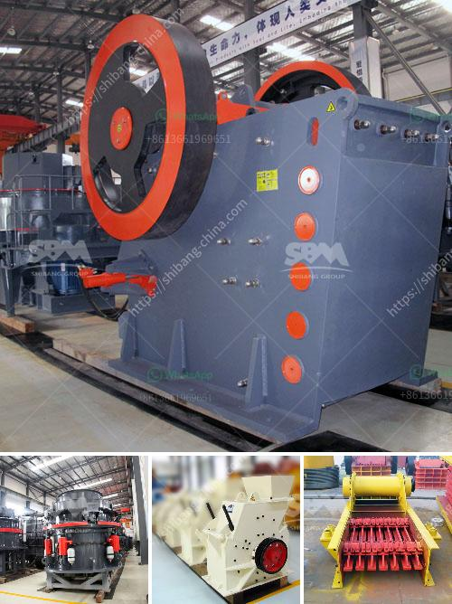

<h3>lm vertical mill</h3>
The LM vertical mill, also known as vertical roller mill, has been widely used in the cement industry for its high efficiency, energy-saving, stable performance and easy operation. It has become the preferred equipment for improving the cement industry's operation rate and reducing energy consumption.

With the continuous development of the cement industry, the demand for cement is increasing day by day. In order to meet the market demand, the traditional ball mill grinding process has been unable to meet the requirements of large-scale production. Therefore, the LM vertical mill emerged as the time required for cement grinding was shortened, and the productivity of cement was greatly improved.

The LM vertical mill has several unique features that make it stand out from other grinding mills. First, the grinding roller and grinding disc are made of high-quality materials, which greatly prolongs their service life and reduces the maintenance cost. Second, the grinding roller is fixed and the disc is rotating, which ensures that the material can be evenly distributed on the grinding plate and effectively ground, eliminating the phenomenon of excessive coarse particles and improving the grinding efficiency. Third, the LM vertical mill adopts a new sealing device, which effectively prevents dust leakage and ensures a clean working environment.

In terms of energy-saving, the LM vertical mill has a unique structure design, which reduces energy consumption by 30% to 40% compared with traditional ball mills. The material stays in the mill for a shorter time, which not only improves the production efficiency, but also reduces the energy consumption during the grinding process.

Additionally, the LM vertical mill is equipped with a high-efficiency separator, which can separate the fine powder from the coarse powder and return the coarse powder to the grinding disc for re-grinding. This not only improves the grinding efficiency, but also ensures the fineness of the finished product.

In terms of operation, the LM vertical mill is simple and easy to operate, with a high degree of automation. It adopts advanced hydraulic system, which can realize automatic control and remote control, reducing labor intensity and improving production efficiency. The control system can monitor and control the entire grinding process, ensuring stable operation and reducing maintenance.

In conclusion, the LM vertical mill is an ideal choice for the cement industry to enhance production efficiency, reduce energy consumption and improve product quality. Its outstanding features of high efficiency, energy-saving, stable performance and easy operation have made it the preferred equipment for many cement manufacturers. With continuous technological innovation, the LM vertical mill will play an even greater role in the cement industry in the future.
<h3>Contact us</h3><ul><li><strong>Whatsapp:&nbsp;<a href="https://wa.me/8613661969651">+8613661969651</a></strong></li><li><a href="https://swt.shibang-china.com/?git&amp;zhl&amp;lm vertical mill"><strong>Online Service(chat now)</strong></a></li></ul><h3>Related</h3><ul><li><a href='cost per hour mobile crusher.md'>cost per hour mobile crusher</a></li><li><a href='2 meter concrete crusher.md'>2 meter concrete crusher</a></li><li><a href='slag grinderr capling.md'>slag grinderr capling</a></li><li><a href='how to make a business plan for crusher plant.md'>how to make a business plan for crusher plant</a></li><li><a href='vertical ball mills of india.md'>vertical ball mills of india</a></li></ul>