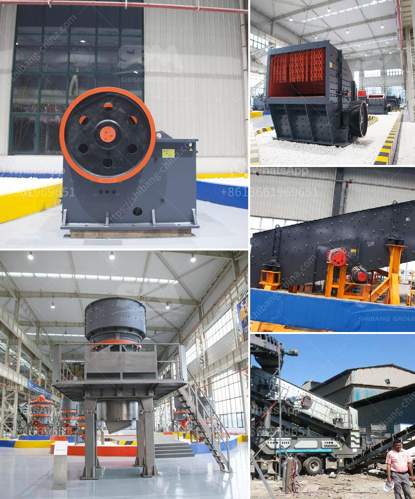

<h3>m sand project cost details</h3>
The construction industry is booming in India and the emphasis is firmly on providing quality sand. India, with its extensive coastline, has a bustling sand mining industry. However, the industry is plagued by various problems; one being the acute shortage of sand. With the amount of sand that is being used for construction, the demand for sand is only rising. This has led to excessive sand mining, which is depleting the natural resources, causing environmental harm, and reducing the diversity in the ecosystem.

To address this issue, the government of India has come up with an innovative solution - Manufactured Sand, or M-Sand. M-Sand is made by crushing rocks and stones to create sand-like textures. There are two types of M-Sand plants that are commonly used. They are classified as dry mix plants and wet mix plants. The dry mix plants produce M-Sand by drying the raw material, which is then mixed with a small amount of cement. The wet mix plants, on the other hand, blend the raw materials, creating a slurry that is mixed with cement to produce high-quality M-Sand.

One of the key advantages of M-Sand is that it's cheaper than river sand. It costs 15 - 20% less than river sand. Another benefit of M-Sand is that it's readily available and can be transported easily. M-Sand is also an environmentally friendly option, as the natural resources are not depleted and there are no harmful impacts on the environment. Additionally, M-Sand has consistent quality, as it is manufactured in controlled conditions, ensuring that it meets the necessary standards.

The cost of M-Sand is one major aspect that customers consider while purchasing it. The price of M-Sand varies from one manufacturer to another. It is advisable to get a quote from multiple vendors and compare the rates. Typically, the cost of M-Sand ranges from Rs. 800 - Rs. 2,000 per ton. The cost varies depending on the manufacturing process, transportation, and availability. M-Sand can be purchased in large quantities, such as 30 tons or more, for commercial purposes. For residential construction projects, it is available in smaller quantities, such as 2-5 tons.

Apart from the cost of M-Sand, it is important to consider the overall project cost. M-Sand is a cost-effective alternative to river sand, but it also requires a certain amount of investment upfront. While the cost of procuring M-Sand plants is high, it is necessary to invest in machinery that produces quality M-Sand. This cost can be recovered over time as M-Sand is sold, and the demand for it is on the rise.

In conclusion, the M-Sand project cost varies depending on several factors. It is important to consider the manufacturing process, transportation, and availability while purchasing M-Sand. While the initial investment in M-Sand plants may seem high, it is a cost-effective alternative to river sand in the long run. The government's push for M-Sand and the increasing demand for quality sand make it a viable option for the construction industry. By choosing M-Sand over river sand, individuals and businesses can not only save costs but also contribute to preserving the environment.
<h3>Contact us</h3><ul><li><strong>Whatsapp:&nbsp;<a href="https://wa.me/8613661969651">+8613661969651</a></strong></li><li><a href="https://swt.shibang-china.com/?git&amp;zhl&amp;m sand project cost details"><strong>Online Service(chat now)</strong></a></li></ul><h3>Related</h3><ul><li><a href='harga mesin ball mill.md'>harga mesin ball mill</a></li><li><a href='process of limestone crusher.md'>process of limestone crusher</a></li><li><a href='mineral industrial crusher.md'>mineral industrial crusher</a></li><li><a href='tph mobile crushing plant.md'>tph mobile crushing plant</a></li><li><a href='how to make a stone crusher mining.md'>how to make a stone crusher mining</a></li></ul>