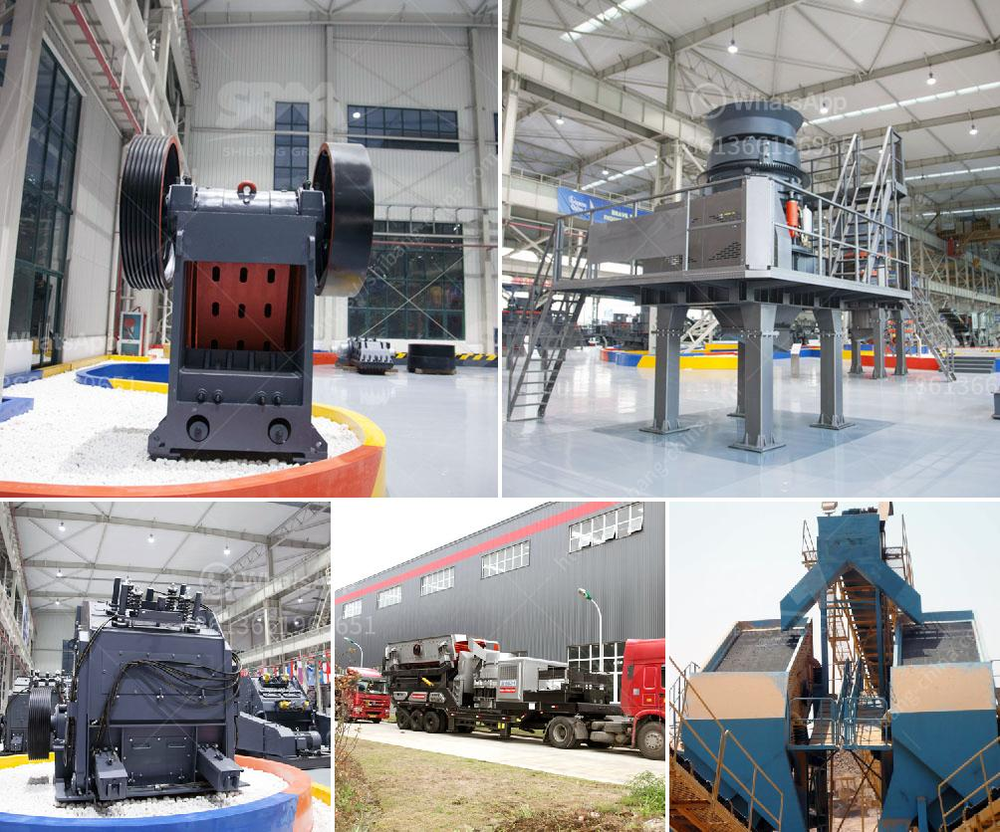

<h3>machine of coal crusher machine</h3>
Coal is the backbone of electricity generation worldwide, providing approximately 40% of the world's power. With ample reserves and growing demand, coal is expected to continue to play a crucial role in meeting global energy needs. However, before coal can be used in power plants, it must be crushed. This is where a coal crusher machine comes into play.

Coal is primarily used as a solid fuel to produce electricity and heat. Through a series of processes known as coal crushing, coal is initially reduced in size to be suitable for further processing. In this stage, coal is fed into the crusher machine and is crushed to smaller pieces. This coal crusher machine is suited for the coal with high moisture (15%water).

This type crusher is suited for the larger particle size materials. We have improved this crusher working method so that ensuring the coal sampling procedure is successful. Besides, the crusher cavity is weld by high-quality steel to avoid cracks and breakage. Due to the crushing technique, there are two common types—double roll crusher and toothed roll crusher.

Double roll crusher is the most used type. We produce industrial roller crushers and laboratory uses small roll crusher. 【Advantages】 Replacement wear-resistant lining, long service life, convenient maintenance. Compact structure, lightweight, small size, for the same production capacity requirements of the crushing system, equipped with roller crusher can significantly save investment. The width of the discharge opening can be adjusted to determine the crushed material size. High reduction ratio, low vibration, dust removal, and less noise.

The toothed roller crusher is suitable for coal, metallurgy, mining, chemical industry, building materials, and other industries, and is more suitable for crushing raw coal (included gangue) of large coal mines or coal preparation plants. It has the characteristics of crushing large pieces of material with a compressive strength of less than 600Mpa.

The main parts are the tooth plate, movable jaw, and fixed jaw. So the tooth plate is the most easily worn part. The tooth plate of the tooth roller crusher is made of high-strength wear-resistant alloy steel, and the standard material is high-strength cast steel. It can avoid casting defects such as porosity, shrinkage cavity, sand inclusion, etc. It has high toughness and is not easily broken by hand. It has high hardness and strong wear resistance. The service life is 2-3 times longer than that of high manganese steel or common wear-resistant alloy.

In recent years, coal crushers are continuously being improved and simplified, aiming to design them with high efficiency, electricity saving, and environmental protection. Since the compression strength of coal is about 5-50, general crusher is able to deal like jaw crusher, impact crusher, and roll crusher, etc. However, there exist special requirements for processing and using the coal, thus Fote technically produces a hammer coal crusher.

Reasons for choosing the hammer coal crusher 1. If you have various demands for the particle size of finished products, the Fote hammer coal crushing machine will help you. Hammer coal crusher machine has advantages of high production capacity and finished product is about 35mm, and it's adjustable to be changed in different models of primary crushing, secondary crushing, and fine crushing.

2. As we all know, the coal is valued and we should use effectively. If the coal is over-crushed, a lot of coal ash will appear. While the hammer coal crusher uses the active forces of hammer to crush coal, you will love this hammer coal crushing machine since it can reduce the appearance of coal ash.

3. If you are in the field of coal crushing, you must be troubled with the coal with high water content. While the hammer coal crusher machine can crush both dry and wet coal. It is completely suitable for the open-pit coal mining work.

Hammer crusher can be used for crushing the materials relying on the impact force. The materials which enter into the hammer crusher can be crushed when meeting the impact force of the high-speed rotating hammer. Under the kinetic energy effect from the hammer, the finished materials rush at high speed towards baffle and sieve. At the same time, the materials strike each other. Then after being crushed, they are discharged out of the crushing chamber from the bottom.

In summary, coal crusher is part of the conveying system of coal crushing plant, which is used for material crushing. It mainly consists of the chassis, rotor, transmission device and other components. The coal crusher machine has the advantages of large crushing ratio, high production capacity, and uniform particle size. Due to its selective crushing of materials, low over-crushing rate, convenient maintenance, and less wear, it is widely recognized by the industry.

With the continuous development of technology, various crushers are widely used in coal crusher machine, and have gradually matured, including underground coal crusher and surface coal crusher. Coal crushers play an important role in moving product from mine-head to market.

In summary, Fote Heavy Machinery has developed with the world's most advanced technology and crushing process, JC series jaw crusher of European version, VSI6X Series vertical shaft impact crusher, and many other new machinery and equipment.

We also provide a full set of services throughout pre-sale, in-sale, and after-sale parameter services, process design, field visit, debugging, and training. Due to our clients' gratitude and recognition, our coal crusher machine has been sold in more than 160 countries and regions around the world. Excellent manufacturers can guarantee the quality of coal crusher machines, and with the continuous development of advanced technology, there are more reliable coal crushing plants.
<h3>Contact us</h3><ul><li><strong>Whatsapp:&nbsp;<a href="https://wa.me/8613661969651">+8613661969651</a></strong></li><li><a href="https://swt.shibang-china.com/?git&amp;zhl&amp;machine of coal crusher machine"><strong>Online Service(chat now)</strong></a></li></ul><h3>Related</h3><ul><li><a href='mineral powder machine.md'>mineral powder machine</a></li><li><a href='gold wash plant at south africa gold mine.md'>gold wash plant at south africa gold mine</a></li><li><a href='price of rollers for conveyor belts.md'>price of rollers for conveyor belts</a></li><li><a href='zinc crusher machine zimbabwe.md'>zinc crusher machine zimbabwe</a></li><li><a href='complete scm stone crushing plant 4tph.md'>complete scm stone crushing plant 4tph</a></li></ul>