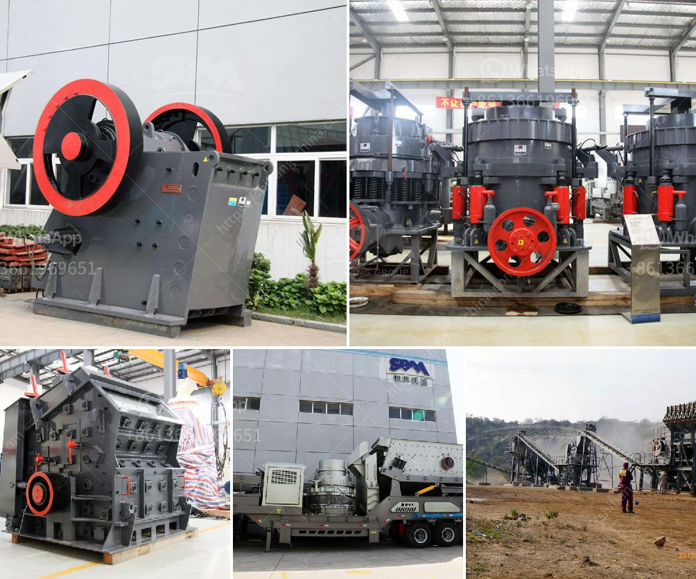

<h3>machinery conveyor belts</h3>
Conveyor belts have revolutionized the manufacturing and transportation industry by providing an efficient and seamless method of moving goods and materials from one location to another. These versatile machinery components are used in a wide range of industries such as mining, automotive, food processing, and packaging.

One of the key advantages of conveyor belts is their ability to handle heavy loads with ease. Designed to withstand rigorous use and harsh working conditions, these belts are constructed from durable materials such as rubber, PVC, or metal. The robust construction ensures that the conveyor belts can handle the weight and pressure of heavy objects, allowing for smooth and efficient movement throughout the manufacturing process.

These machinery conveyor belts are also highly customizable, allowing businesses to cater to their specific needs and requirements. Different belt types, including flat belts, modular belts, and timing belts, can be chosen based on the application and the type of materials being transported. The belts can be customized in terms of width, length, and design to fit into the existing production line seamlessly.

Additionally, conveyor belts offer significant time and cost savings. With the automated movement of materials, companies can streamline their production processes, reduce manual labor, and increase operational efficiency. These belts are designed to minimize downtime, ensuring that the production line runs smoothly without interruptions.

Furthermore, conveyor belts can enhance workplace safety by reducing the risk of manual handling injuries. By eliminating the need for manual material handling, these belts provide a safer working environment for employees. This, in turn, increases productivity and reduces the likelihood of accidents or injuries occurring.

In conclusion, machinery conveyor belts are an indispensable component in numerous industries. Their durability, versatility, and customization options make them the ideal choice for improving efficiency and productivity in manufacturing and transportation processes. With the ability to handle heavy loads, reduce manual labor, and enhance workplace safety, conveyor belts have undoubtedly reshaped the way products are produced and transported worldwide.
<h3>Contact us</h3><ul><li><strong>Whatsapp:&nbsp;<a href="https://wa.me/8613661969651">+8613661969651</a></strong></li><li><a href="https://swt.shibang-china.com/?git&amp;zhl&amp;machinery conveyor belts"><strong>Online Service(chat now)</strong></a></li></ul><h3>Related</h3><ul><li><a href='price of stone crusher capacity 200 tons per hour.md'>price of stone crusher capacity 200 tons per hour</a></li><li><a href='potassium ore production equipment.md'>potassium ore production equipment</a></li><li><a href='small rotary burner for sale used in us.md'>small rotary burner for sale used in us</a></li><li><a href='jaw crusher with production capacity of ton hr.md'>jaw crusher with production capacity of ton hr</a></li><li><a href='how much does it cost to set up a mini cement plant.md'>how much does it cost to set up a mini cement plant</a></li></ul>