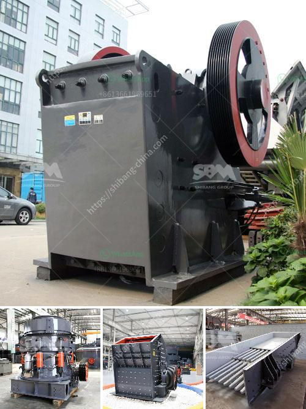

<h3>machinery for hydrated lime powder</h3>
Hydrated lime is a crucial ingredient widely used across various industries including construction, agriculture, chemical, and environmental. It is a fine white powder that is obtained by adding water to quicklime, a process also known as slaking. The resulting hydrated lime powder finds applications in water treatment, pH adjustment in soils, flue gas desulfurization, and many more.

In order to produce high-quality hydrated lime powder, efficient machinery is required. The machinery used for manufacturing hydrated lime powder relies on several key processes.

Firstly, the raw material, quicklime, is carefully selected and sourced from reputable suppliers. Quicklime is made by heating high-quality limestone or dolomite at high temperatures until it undergoes a chemical transformation. This process ensures excellent purity and consistent quality of the hydrated lime powder produced.

Once the raw quicklime is obtained, it is transported to the hydration facility, where it undergoes the slaking process. This is where specialized machinery comes into play. The slaking process involves adding carefully measured amounts of water to the quicklime in controlled conditions. This machinery ensures precise control over the amount of water added to achieve the desired hydration level.

After the slaking process, the resulting hydrated lime slurry undergoes further processing to remove impurities and excess water. The machinery used for this purpose typically includes lime classifiers, settling tanks, and filters.

Once the excess water is removed, the final step involves drying the hydrated lime slurry to obtain the desired hydrated lime powder. The machinery used for drying can include spray dryers, rotary dryers, or fluidized bed dryers. These machines ensure the removal of all moisture from the hydrated lime slurry while maintaining the integrity and quality of the powder.

In conclusion, the manufacturing of high-quality hydrated lime powder requires specialized machinery that ensures precise control over the slaking process, efficient removal of impurities, and effective drying. With the right machinery, industries can obtain consistent and reliable hydrated lime powder that meets their specific requirements.
<h3>Contact us</h3><ul><li><strong>Whatsapp:&nbsp;<a href="https://wa.me/8613661969651">+8613661969651</a></strong></li><li><a href="https://swt.shibang-china.com/?git&amp;zhl&amp;machinery for hydrated lime powder"><strong>Online Service(chat now)</strong></a></li></ul><h3>Related</h3><ul><li><a href='vertical grinding machine for marble.md'>vertical grinding machine for marble</a></li><li><a href='used big mobile jaw crusher in dubai.md'>used big mobile jaw crusher in dubai</a></li><li><a href='1 tonne gypsum processing machine.md'>1 tonne gypsum processing machine</a></li><li><a href='crusher price in malaysia stones.md'>crusher price in malaysia stones</a></li><li><a href='gypsum board production line for sale.md'>gypsum board production line for sale</a></li></ul>