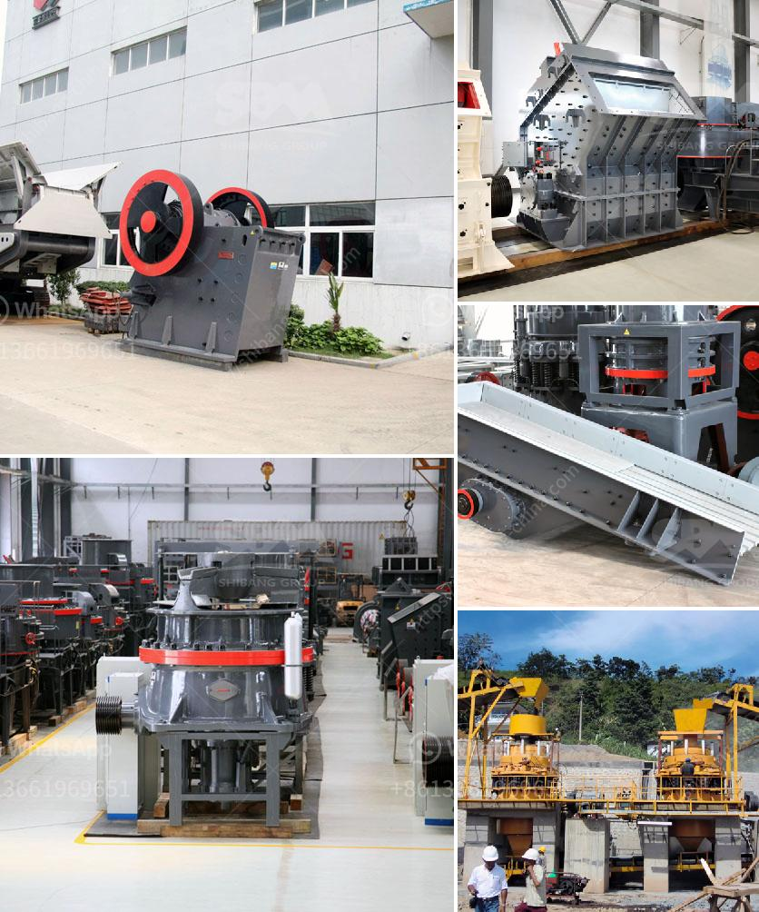

<h3>machinery for starch plant japan</h3>
Japan is well-known for its technological advancements, and the machinery used in starch plants is no exception. Starch plants in Japan utilize cutting-edge equipment and innovative machinery to produce high-quality starch products efficiently.

One of the most vital machinery used in starch plants is the starch extraction machine. This machine plays a crucial role in the starch production process by separating the starch from its source, typically rice or potatoes. Using advanced techniques such as centrifugation and filtration, these machines can extract starch from the raw materials with minimal loss and maximum efficiency.

Another important machinery is the starch dryer. Once the starch is extracted, it needs to be dried to achieve the desired moisture content. Starch dryers in Japanese starch plants employ state-of-the-art drying technologies, including hot air drying and flash drying techniques. These dryers ensure that the starch is dried uniformly and quickly, preserving its quality and preventing any spoilage.

In addition to extraction and drying machinery, starch plants in Japan also utilize equipment for starch purification and packaging. Starch purification machines utilize various processes, such as decanting, centrifugation, and hydrocyclones, to remove impurities and obtain a pure starch product. The packaged starch is then automatically filled and sealed using high-speed packaging machines, ensuring hygienic and efficient packaging.

Automation and robotics are key to achieving high productivity and efficiency in Japanese starch plants. Automated systems and robotics are extensively used for material handling, product sorting, quality control, and packaging. These machines not only reduce labor costs but also improve accuracy and minimize human errors in the starch production process.

Furthermore, stringent environmental regulations in Japan have led to the development of eco-friendly machinery for starch plants. Sustainable technologies, such as energy-efficient drying systems and wastewater treatment plants, are employed to minimize the environmental impact of starch production.

Overall, Japan's starch plants are at the forefront of technological innovation, utilizing advanced machinery to produce high-quality starch products efficiently. The use of cutting-edge extraction, drying, purification, and packaging machinery, coupled with automation and environmental-friendly technologies, ensures Japan's starch plants remain globally competitive and environmentally responsible.
<h3>Contact us</h3><ul><li><strong>Whatsapp:&nbsp;<a href="https://wa.me/8613661969651">+8613661969651</a></strong></li><li><a href="https://swt.shibang-china.com/?git&amp;zhl&amp;machinery for starch plant japan"><strong>Online Service(chat now)</strong></a></li></ul><h3>Related</h3><ul><li><a href='copper ore processing plant kenya.md'>copper ore processing plant kenya</a></li><li><a href='stone crusher america.md'>stone crusher america</a></li><li><a href='gravel washing plant.md'>gravel washing plant</a></li><li><a href='operating costs for a stone crusher plant.md'>operating costs for a stone crusher plant</a></li><li><a href='stone crusher sale in peru.md'>stone crusher sale in peru</a></li></ul>