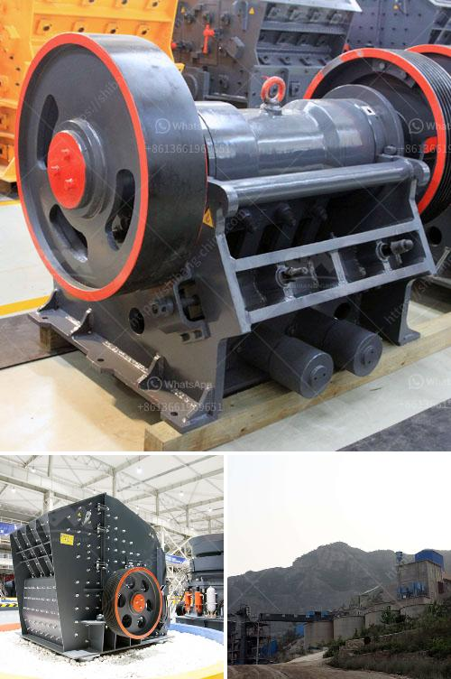

<h3>malaysia conveyor belts price</h3>
Conveyor belts are any type of looped belt or rotating chain that is used in the process of moving objects from one point to another. Conveyor belts are widely used in various industries, including manufacturing, distribution, logistics, and transportation. In Malaysia, conveyor belts are commonly used in food processing, agriculture, packaging, mining, pharmaceuticals, automotive, and many other industries.

When it comes to purchasing conveyor belts in Malaysia, it is essential to consider factors such as the desired belt specifications, type of material being transported, system design, as well as the overall cost of the equipment. The price of conveyor belts can vary depending on various factors, such as the type of belt material, length, width, thickness, and additional features.

One of the primary considerations when determining the price of conveyor belts is the material used in their construction. Conveyor belts can be made from various materials, such as rubber, fabric, metal, plastic, or a combination of these materials. Each material has its advantages and disadvantages, influencing the price point. For instance, rubber conveyor belts are known for their durability, flexibility, and resistance to abrasion, making them suitable for heavy-duty applications. On the other hand, metal conveyor belts offer increased strength and heat resistance, making them suitable for high-temperature environments.

Another crucial factor influencing the price of conveyor belts is the size and specifications required for a specific application. A longer, wider, or thicker conveyor belt generally costs more due to the increased material usage. Additionally, specialized features such as cleats, sidewalls, or covers can impact the overall price.

In Malaysia, the price of conveyor belts also depends on the brand and manufacturer. There are several local and international conveyor belt manufacturers in Malaysia, each offering different products with varying prices. Some well-known conveyor belt brands include Yokohama, Bando, Bridgestone, Contitech, Fenner Dunlop, and Oriental Rubber.

Apart from the initial purchase price, it is essential to consider additional costs associated with conveyor belts. This includes installation, maintenance, and eventual replacement of the belts. Some conveyor belt suppliers in Malaysia provide installation and maintenance services, which might come at an additional cost. Regular maintenance and inspection of the conveyor belt system are crucial to ensure its longevity and optimal performance.

It is recommended to check with multiple suppliers or manufacturers to compare prices, quality, and services offered. Additionally, acquiring quotations and conducting thorough research can help in making an informed purchasing decision.

In conclusion, the price of conveyor belts in Malaysia is influenced by various factors such as belt material, size, specifications, brand, and additional features. It is crucial for businesses to carefully consider their requirements and budget to select the most suitable conveyor belt solution. Consulting with experts and conducting proper research can assist in finding the best conveyor belt at an affordable price.
<h3>Contact us</h3><ul><li><strong>Whatsapp:&nbsp;<a href="https://wa.me/8613661969651">+8613661969651</a></strong></li><li><a href="https://swt.shibang-china.com/?git&amp;zhl&amp;malaysia conveyor belts price"><strong>Online Service(chat now)</strong></a></li></ul><h3>Related</h3><ul><li><a href='bauxite manufacture equipment in india.md'>bauxite manufacture equipment in india</a></li><li><a href='marble crushing equipment.md'>marble crushing equipment</a></li><li><a href='rock crushing plants for sale.md'>rock crushing plants for sale</a></li><li><a href='primary stone crusher.md'>primary stone crusher</a></li><li><a href='usine carbonate de calcium.md'>usine carbonate de calcium</a></li></ul>