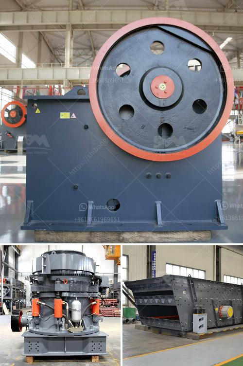

<h3>malaysia mobile cone crusher price</h3>
Malaysia, a rapidly developing country in Southeast Asia, is known for its vibrant economy and rich natural resources. It is also home to a thriving construction and mining industry, which has seen a significant increase in demand for mobile cone crushers.

Mobile cone crushers are highly efficient machines for crushing stones, rocks, and ores. They are compact, portable, and easy to transport, making them an ideal choice for construction projects in remote areas. These crushers are equipped with advanced features such as hydraulic settings, tramp release, and automated controls, allowing operators to easily adjust the size of the final product.

One of the key factors driving the demand for mobile cone crushers in Malaysia is the rise of infrastructure projects. The government has invested heavily in these projects, including the construction of highways, railways, and airports. Mobile cone crushers are essential equipment for these projects as they can efficiently process large quantities of materials in a relatively short period.

Another factor contributing to the popularity of mobile cone crushers in Malaysia is the increasing demand for aggregates. These are essential construction materials widely used in various applications, including concrete production, road construction, and foundation works. Mobile cone crushers can effectively produce high-quality aggregates, which are in high demand in Malaysia's construction industry.

Furthermore, the price of mobile cone crushers in Malaysia is relatively affordable compared to other construction equipment. With the increasing popularity of mobile cone crushers, there has been a surge in supply from both local and international manufacturers. As a result, competition among suppliers has led to competitive prices for these machines.

In conclusion, the demand for mobile cone crushers in Malaysia is driven by the growth of infrastructure projects and the increasing need for aggregates. These machines offer efficient and reliable crushing capabilities, making them an essential tool in the construction and mining industry. Furthermore, their relatively affordable prices make them a cost-effective choice for businesses and contractors. As Malaysia continues to develop and expand its construction sector, the demand for mobile cone crushers is expected to rise further.
<h3>Contact us</h3><ul><li><strong>Whatsapp:&nbsp;<a href="https://wa.me/8613661969651">+8613661969651</a></strong></li><li><a href="https://swt.shibang-china.com/?git&amp;zhl&amp;malaysia mobile cone crusher price"><strong>Online Service(chat now)</strong></a></li></ul><h3>Related</h3><ul><li><a href='marble crushing equipment.md'>marble crushing equipment</a></li><li><a href='complete scm stone crushing plant 4tph.md'>complete scm stone crushing plant 4tph</a></li><li><a href='coal washing plant in philippines south africa.md'>coal washing plant in philippines south africa</a></li><li><a href='price of stone crusher machine in nigeria.md'>price of stone crusher machine in nigeria</a></li><li><a href='mobile crusher for salt.md'>mobile crusher for salt</a></li></ul>