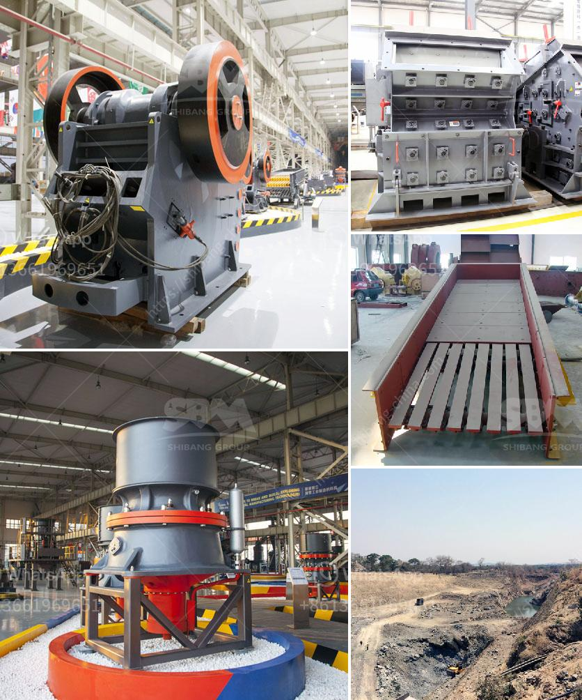

<h3>manganese processing plant in south africa</h3>
Manganese is an essential mineral used in various industrial and agricultural applications. It is commonly found in nature as a component of ores, often alongside iron. South Africa is a major producer of manganese, globally, accounting for about 33% of its total production. As such, the country plays a significant role in the global manganese market.

One of the key facilities responsible for processing manganese in South Africa is the Kalagadi Manganese Mine and Sinter Plant, located in the Northern Cape province. The project, which is a joint venture between South African companies, Kalagadi Manganese and ArcelorMittal, aims to produce about three million tonnes of manganese ore per annum.

The processing plant at Kalagadi consists of a crushing circuit, screening plant, and beneficiation plant. It is capable of producing high-grade manganese metal, flakes, and manganese-rich agglomerates. These products are utilized in the production of steel, batteries, fertilizers, and other industrial applications.

The plant operates using state-of-the-art technologies and adheres to strict environmental standards. It employs advanced filtration and water treatment systems to ensure minimal impact on surrounding ecosystems. Additionally, the facility promotes sustainable mining practices and emphasizes the responsible use of natural resources.

The manganese processing plant in South Africa serves as a significant player in both the local and global manganese industry. Its strategic location near the Kalahari Basin, a region rich in manganese reserves, ensures a steady supply of raw material for processing. Moreover, the plant creates employment opportunities for local communities and contributes to the country's economic growth.

In conclusion, South Africa's manganese processing plant contributes significantly to the country's manganese production and plays a crucial role in meeting global demand. With its advanced technologies, strict environmental standards, and commitment to sustainable mining practices, the facility remains at the forefront of the industry.
<h3>Contact us</h3><ul><li><strong>Whatsapp:&nbsp;<a href="https://wa.me/8613661969651">+8613661969651</a></strong></li><li><a href="https://swt.shibang-china.com/?git&amp;zhl&amp;manganese processing plant in south africa"><strong>Online Service(chat now)</strong></a></li></ul><h3>Related</h3><ul><li><a href='coal crushing process.md'>coal crushing process</a></li><li><a href='ball mills vietnam.md'>ball mills vietnam</a></li><li><a href='how much cost to buildton cement plant.md'>how much cost to buildton cement plant</a></li><li><a href='mobile jaw crusher tons per hour.md'>mobile jaw crusher tons per hour</a></li><li><a href='vertical ball mills of india.md'>vertical ball mills of india</a></li></ul>