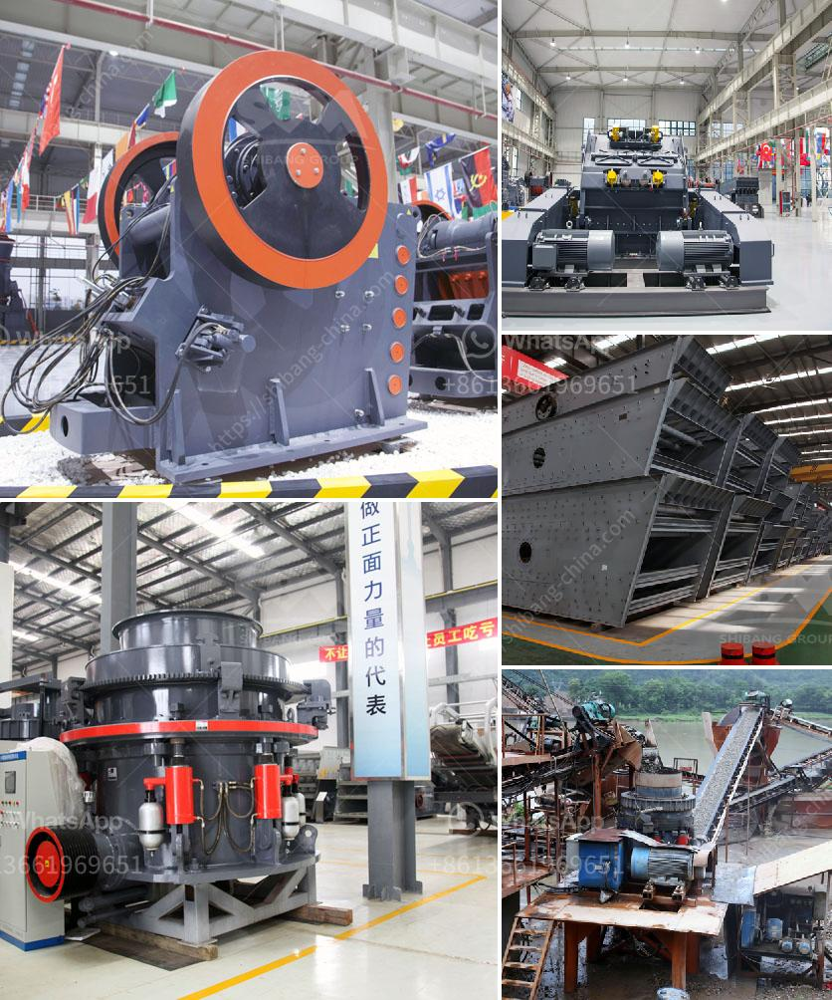

<h3>manganese wash plant zambia</h3>
In recent years, the demand for manganese, a critical metal used in various industries, has been on the rise. As the global population grows and urbanization continues, the need for steel and other manganese-based products has increased exponentially. Zambia, a landlocked country in Southern Africa, is one of the world's leading producers and exporters of manganese.

With its abundant natural resources and mining expertise, Zambia has become a major player in the global manganese market. The country boasts vast reserves of high-quality manganese ore, making it an attractive destination for mining companies. However, the extraction and processing of manganese come with environmental challenges that need to be addressed.

One important aspect of manganese mining is the washing process. Since manganese ore is typically associated with impurities such as clay, silica, and iron oxides, washing the ore before it is shipped to processing plants is crucial. This process helps remove impurities, improving the quality of the product and reducing environmental impacts.

Manganese wash plants, like the one in Zambia, play a vital role in ensuring sustainable manganese mining operations. These plants use various techniques to separate the valuable manganese ore from the impurities, resulting in a cleaner and more valuable product. They employ water-based methods such as hydrocyclones, spirals, and jigs to remove unwanted materials effectively.

One such manganese wash plant in Zambia, known for its efficiency and eco-friendly practices, is committed to sustainable mining practices. The plant employs advanced technologies to minimize water usage and recycle it, ensuring a responsible use of this precious resource. With a closed-loop system, they are able to reuse water, reducing their environmental footprint significantly.

Furthermore, the plant is equipped with state-of-the-art filtration systems to prevent the release of harmful sediments and chemicals into the surrounding environment. Adequate waste management practices, such as proper disposal of slurry and residues, are strictly adhered to, minimizing the impact on local ecosystems.

Beyond the wash plant operations, these facilities also contribute to the overall environmental conservation efforts in Zambia. Many manganese mining companies make substantial financial investments in reforestation and land rehabilitation programs to restore the ecosystems affected by mining activities. They work closely with local communities and organizations to ensure a sustainable future for both the environment and the people.

In conclusion, manganese wash plants in Zambia are integral to sustainable manganese mining operations. By employing cutting-edge technologies and adhering to responsible mining practices, these plants play a crucial role in protecting the environment while meeting the growing demand for manganese worldwide. Additionally, their commitment to reforestation and land rehabilitation demonstrates their dedication to the long-term well-being of the local ecosystems. As the demand for manganese continues to soar, it is essential to ensure that mining activities go hand in hand with environmental sustainability.
<h3>Contact us</h3><ul><li><strong>Whatsapp:&nbsp;<a href="https://wa.me/8613661969651">+8613661969651</a></strong></li><li><a href="https://swt.shibang-china.com/?git&amp;zhl&amp;manganese wash plant zambia"><strong>Online Service(chat now)</strong></a></li></ul><h3>Related</h3><ul><li><a href='lime stone screw conveyor.md'>lime stone screw conveyor</a></li><li><a href='cost per hour mobile crusher.md'>cost per hour mobile crusher</a></li><li><a href='small scale tantalum milling machine supplier.md'>small scale tantalum milling machine supplier</a></li><li><a href='grinding mill machine cost price south africa.md'>grinding mill machine cost price south africa</a></li><li><a href='rubber belt conveyor for sale.md'>rubber belt conveyor for sale</a></li></ul>