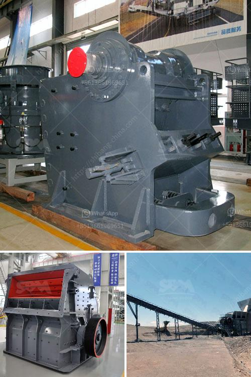

<h3>manufacture of conveyor belts in bogota</h3>
Bogota, the capital city of Colombia, has emerged as a prominent manufacturing hub for various industries, including the production of high-quality conveyor belts. Over the years, Bogota has developed a strong reputation for its expertise in manufacturing, offering cutting-edge solutions to meet the demanding needs of businesses worldwide. This article explores the manufacture of conveyor belts in Bogota, highlighting the city's unique advantages and the reasons behind its success in this industry.

Conveyor belts play a crucial role in numerous industries, such as agriculture, mining, manufacturing, packaging, and more. With globalization propelling the growth of these sectors, the demand for advanced conveyor belts has been on the rise. Bogota's strategic location, coupled with its skilled labor force and robust infrastructure, makes it an ideal hub for manufacturers to cater to the booming global demand.

Bogota boasts an abundance of highly skilled professionals who have undergone extensive training in engineering and manufacturing disciplines. These professionals bring technical know-how and innovative ideas to the table, allowing manufacturers in Bogota to develop conveyor belts that are efficient, durable, and tailored to customer specifications.

The city's strong ties between industry and academia have fostered collaboration and innovation. Universities and technical institutes in Bogota offer specialized programs and research facilities that focus on conveyor belt manufacturing. This collaboration ensures a constant flow of new ideas, technologies, and skilled talent into the industry, driving its growth and competitiveness.

Bogota boasts modern infrastructure and manufacturing facilities that are crucial for producing conveyor belts to meet global standards. Advanced machinery, computerized systems, and automation technologies are readily available, facilitating the production process and enhancing overall efficiency. Manufacturers in Bogota can seamlessly incorporate advanced technologies like robotics, material handling systems, and precision engineering to create high-quality conveyor belts.

Conveyor belts manufactured in Bogota undergo stringent quality control processes to ensure superior performance and longevity. Manufacturers are committed to upholding international standards, acquiring certifications such as ISO 9001 to demonstrate their commitment to quality and customer satisfaction. These certifications add credibility to the products, making Bogota a preferred destination for conveyor belt procurement.

Bogota's strategic location in South America provides a competitive advantage for manufacturers looking to export their products worldwide. With well-developed transportation networks, including air, sea, and land routes, Bogota offers excellent connectivity to major international markets. This connectivity, coupled with the city's reputation for manufacturing excellence, positions Bogota prominently on the global conveyor belt manufacturing map.

With its skilled workforce, technical expertise, modern infrastructure, and strong ties between industry and academia, Bogota continues to thrive as a manufacturing hub for conveyor belts. The city's commitment to quality production, adherence to international standards, and ease of export makes it an attractive destination for businesses worldwide looking for reliable conveyor belt solutions. As Bogota's conveyor belt manufacturing industry continues to evolve, it stands poised to meet the ever-growing global demand for efficient, durable, and innovative conveyor belt systems.
<h3>Contact us</h3><ul><li><strong>Whatsapp:&nbsp;<a href="https://wa.me/8613661969651">+8613661969651</a></strong></li><li><a href="https://swt.shibang-china.com/?git&amp;zhl&amp;manufacture of conveyor belts in bogota"><strong>Online Service(chat now)</strong></a></li></ul><h3>Related</h3><ul><li><a href='mini cement plant project report.md'>mini cement plant project report</a></li><li><a href='small scale gold processing machines price list.md'>small scale gold processing machines price list</a></li><li><a href='output size for a jaw crusher.md'>output size for a jaw crusher</a></li><li><a href='hammer mill prices.md'>hammer mill prices</a></li><li><a href='olx used crusher machines.md'>olx used crusher machines</a></li></ul>