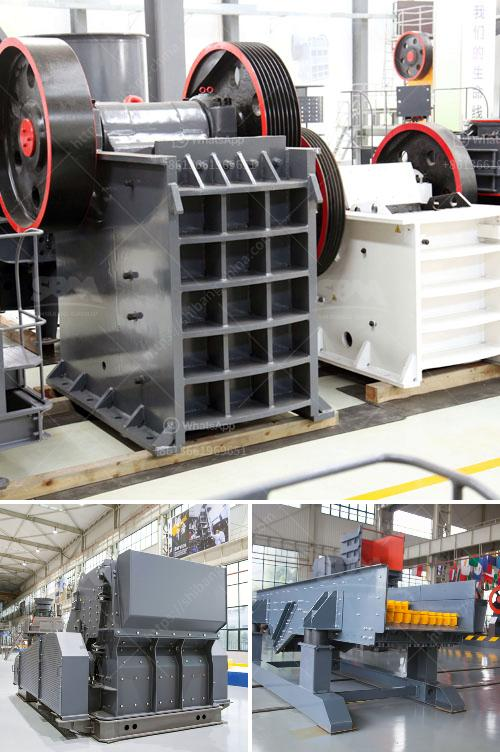

<h3>manufacture of conveyor belts</h3>
Conveyor belts have become an integral part of various industries, facilitating the smooth movement of materials from one place to another. The manufacturing process for conveyor belts involves several steps, ensuring their durability and efficiency. 

The first step in the manufacture of conveyor belts is the selection of high-quality raw materials. Different types of materials are used, including rubber, PVC, or nylon, depending on the specific requirements of the industry. The chosen material is then mixed with a variety of additives and stabilizers to enhance its strength, flexibility, and resistance to wear and tear.

Once the raw materials have been prepared, they are processed through a series of machines. These machines can include calenders, extruders, and vulcanizing presses, which shape and mould the materials into the desired width, thickness, and length. The conveyor belts are often reinforced with layers of fabric or steel mesh to increase their load capacity and durability.

During the manufacturing process, the conveyor belts undergo several quality control checks to ensure they meet the required industry standards. These checks include testing for tensile strength, elongation, abrasion resistance, and adherence to specified dimensions. Only belts that pass these rigorous tests are deemed fit for use.

After the manufacturing process is completed, the conveyor belts are ready for installation. They can be customized to suit specific applications, such as heavy-duty mining or food processing. Skilled technicians carefully install the conveyor belts, ensuring proper alignment and tension. Regular maintenance and inspections are essential to keep the belts operating efficiently, thereby prolonging their lifespan.

In conclusion, the manufacture of conveyor belts involves meticulous attention to detail, from selecting high-quality raw materials to the final installation and maintenance. These belts play a crucial role in various industries, providing a reliable and efficient method of material transportation.
<h3>Contact us</h3><ul><li><strong>Whatsapp:&nbsp;<a href="https://wa.me/8613661969651">+8613661969651</a></strong></li><li><a href="https://swt.shibang-china.com/?git&amp;zhl&amp;manufacture of conveyor belts"><strong>Online Service(chat now)</strong></a></li></ul><h3>Related</h3><ul><li><a href='stone crusher machine in saudi arabia.md'>stone crusher machine in saudi arabia</a></li><li><a href='portable hydraulic rock crusher.md'>portable hydraulic rock crusher</a></li><li><a href='gold mining equipment for sale in singapore.md'>gold mining equipment for sale in singapore</a></li><li><a href='copper ore vertical ball mill.md'>copper ore vertical ball mill</a></li><li><a href='clay crusher machine in india.md'>clay crusher machine in india</a></li></ul>