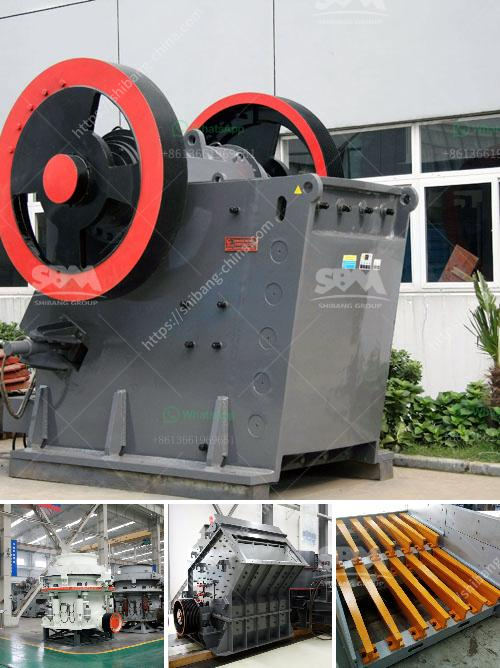

<h3>manufacturer of industrial hammer mill</h3>
A hammer mill is a crucial piece of equipment in the industrial manufacturing process. It is used to reduce the size of materials through a series of high-speed impacts. Whether it's grain, corn, wood, or another biomass material, hammer mills can effectively pulverize it into smaller particles to facilitate further processing.

When searching for a manufacturer of industrial hammer mills, it is essential to find a reputable company that offers high-quality products. One such manufacturer that has gained recognition in the industry is XYZ Corporation.

XYZ Corporation is a leading manufacturer of industrial hammer mills, offering a wide range of models to suit various applications. With years of experience and a solid reputation, XYZ has become a trusted name among its customers.

One of the key advantages of XYZ's hammer mills is their robust construction. They are built to withstand the demanding conditions of industrial operations. The heavy-duty design ensures long-lasting performance, even in the most challenging environments. From the frame to the rotor, every component is carefully engineered and manufactured to meet the highest standards of quality.

In addition to their durability, XYZ's hammer mills are also known for their versatility. Different models are available with varying capacities and power options, allowing customers to choose the most suitable one for their specific needs. Whether it's a small-scale operation or a large industrial plant, XYZ has a hammer mill to suit every requirement.

Another standout feature of XYZ's hammer mills is their advanced technology. The company invests heavily in research and development to incorporate the latest innovations into their products. The state-of-the-art control systems ensure precise and efficient operation, optimizing the performance of the hammer mills and achieving maximum productivity.

Moreover, XYZ Corporation places great emphasis on customer satisfaction. They provide excellent after-sales service, including prompt technical support and spare parts availability. Their team of knowledgeable professionals is always ready to assist customers in troubleshooting or optimizing their hammer mills for specific applications.

Environmental sustainability is also a priority for XYZ Corporation. The company is committed to reducing its environmental footprint and offers hammer mills that comply with the latest environmental regulations. Through continuous improvement, XYZ strives to minimize energy consumption and emissions from its manufacturing processes.

In conclusion, XYZ Corporation is a reputable manufacturer of industrial hammer mills. Their products are known for their durability, versatility, advanced technology, and commitment to customer satisfaction and environmental sustainability. Whether you are in the grain, wood, or biomass industry, XYZ's hammer mills are a reliable choice for efficient size reduction.
<h3>Contact us</h3><ul><li><strong>Whatsapp:&nbsp;<a href="https://wa.me/8613661969651">+8613661969651</a></strong></li><li><a href="https://swt.shibang-china.com/?git&amp;zhl&amp;manufacturer of industrial hammer mill"><strong>Online Service(chat now)</strong></a></li></ul><h3>Related</h3><ul><li><a href='stone crusher sale in peru.md'>stone crusher sale in peru</a></li><li><a href='concrete crusher for sale in nigeria.md'>concrete crusher for sale in nigeria</a></li><li><a href='ball mill grinder for sale.md'>ball mill grinder for sale</a></li><li><a href='processing plant for sale south africa.md'>processing plant for sale south africa</a></li><li><a href='distributor belt conveyor di philippines.md'>distributor belt conveyor di philippines</a></li></ul>