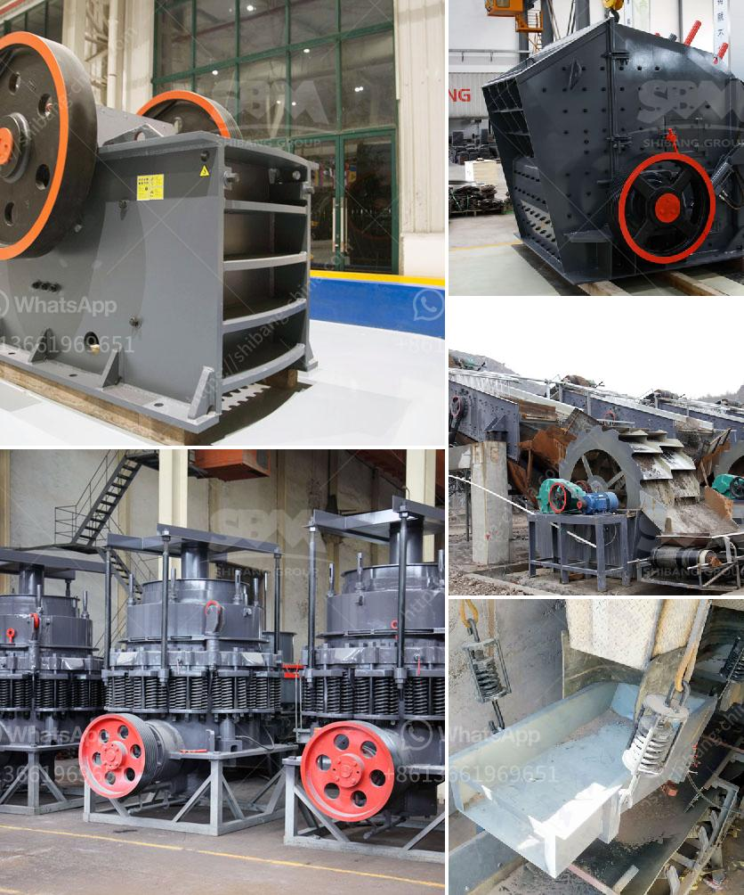

<h3>marble crusher germany</h3>
Marble is a natural stone that has been utilized for centuries in creating landmarks such as statues, buildings, and monuments. It is a popular choice for architectural and design purposes due to its elegance, durability, and versatility. However, the extraction and processing of marble require specialized equipment, one of which is the marble crusher. Germany, known for its high-quality engineering and craftsmanship, is renowned for its marble production and has a long-standing history in the industry.

A marble crusher is a powerful machine that is used to crush large marble chunks into smaller pieces or powder. There are various types of marble crushers, such as jaw crushers, cone crushers, impact crushers, and hammer crushers. Different crushers have different features and advantages, and each is engineered for specific tasks in the crushing process.

Germany, being one of the leading producers of marble, offers a vast array of marble crushers. German machinery and equipment manufacturers have been renowned worldwide for their precision engineering and high-quality manufacturing. German marble crushers are designed with advanced technology and are built to withstand heavy-duty operations.

One of the well-known German manufacturers of marble crushers is Kleemann. Kleemann is known for its high-performance mobile crushers that feature robust construction, advanced control systems, and efficient crushing capabilities. Their crushers are widely used in various industries, including mining, construction, and recycling.

The marble crusher Germany is equipped with the latest technologies to ensure optimal performance and productivity. For instance, the Kleemann MC 110 Z model is a mobile jaw crusher that is ideal for processing natural rock and demolishing waste materials. It can reach a maximum feed capacity of 330 tons per hour and has a powerful crusher drive. The machine also offers a double-deck prescreen and a single-toggle jaw crusher, both of which contribute to efficient and precise crushing.

Apart from Kleemann, other German manufacturers also offer reliable marble crushers. For example, SBM, a well-established company, provides a range of marble crushers, including stationary and mobile options. Their crushers feature high crushing ratio, low energy consumption, and easy maintenance, making them suitable for various applications.

In summary, Germany is a prominent player in the marble industry and offers a wide range of high-quality marble crushers. Marble extraction and crushing require specialized equipment, and German manufacturers provide machines that are durable, efficient, and capable of handling heavy-duty operations. Furthermore, German marble crushers are designed with the latest technologies to ensure optimal performance and productivity. Whether it is for mining, construction, or recycling purposes, the marble crusher Germany is a reliable and efficient tool for breaking down marble into smaller pieces or powder, contributing to the production of various architectural and design elements that make our world more beautiful.
<h3>Contact us</h3><ul><li><strong>Whatsapp:&nbsp;<a href="https://wa.me/8613661969651">+8613661969651</a></strong></li><li><a href="https://swt.shibang-china.com/?git&amp;zhl&amp;marble crusher germany"><strong>Online Service(chat now)</strong></a></li></ul><h3>Related</h3><ul><li><a href='jaw crusher in german.md'>jaw crusher in german</a></li><li><a href='mineral powder machine.md'>mineral powder machine</a></li><li><a href='gypsum vibrating screen.md'>gypsum vibrating screen</a></li><li><a href='cement plant machinery manufacturers in germany.md'>cement plant machinery manufacturers in germany</a></li><li><a href='portable hydraulic rock crusher.md'>portable hydraulic rock crusher</a></li></ul>