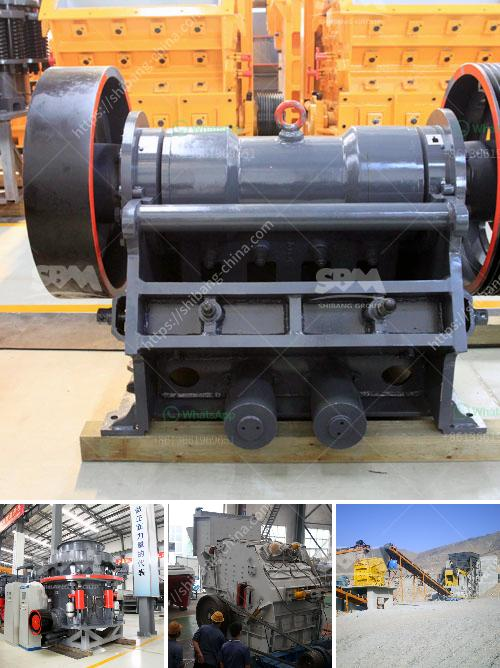

<h3>marble crushing equipment</h3>
Marble is a popular natural stone used for various applications, such as countertops, flooring, and sculptures. With its beautiful veining patterns and durability, marble has been prized for centuries. However, before it can be used in these applications, it needs to go through a rigorous process of extraction and processing. This is where marble crushing equipment comes into play.

Marble crushing equipment is crucial for the extraction and processing of marble. In general, the marble crushing equipment includes jaw crusher, impact crusher, cone crusher, and mobile crusher. Each type of marble crusher has its own function and advantages. The choice of crusher depends on the type and amount of material to be crushed.

Jaw crushers are ideally suited for primary crushing. The jaw crusher works by compressing the material between a fixed jaw and a moving jaw, so as to crush the material into smaller pieces. The crushed marble pieces are then screened to determine their size and shape. Cone crushers, on the other hand, are more suited for secondary crushing. They are designed to crush the material between a mantle and a concave, ensuring a fine and uniform product.

Impact crushers are ideal for crushing soft and medium-hard materials, such as limestone, gypsum, and marble. They are typically used in the production of aggregate, concrete, and asphalt. The impact crusher uses a rotor to rotate at high speed, which impacts the material and breaks it apart. This process produces a high-quality product with a cubical shape.

Mobile crushers, as the name suggests, are crushers that can be moved easily. They are often used in construction sites and mining operations where the crushing equipment needs to be transported from one location to another. Mobile crushers allow for greater flexibility and efficiency in crushing operations.

In addition to these primary crushing equipment, there are also auxiliary machines used in the marble crushing process. Vibrating feeders feed the material into the jaw crusher or impact crusher for primary crushing. The vibrating screen screens the crushed marble into different grades.

Marble crushing equipment is essential for any marble crushing plant. It ensures the efficient production of high-quality crushed marble. With the increasing demand for marble aggregate, it is crucial to choose the right marble crusher and marble crushing equipment to reduce the production costs and improve the efficiency.

When choosing marble crushing equipment, there are a few factors to consider. Firstly, the hardness and density of the material should be taken into account. This will determine the type of crusher required. Secondly, the desired output size and shape of the crushed marble should be considered. This will determine the type of screen used.

Lastly, the production capacity and energy consumption should also be considered. This will determine the size and power of the crusher. It is important to conduct thorough research and work closely with a reputable supplier to ensure the selection of the right marble crushing equipment for your specific needs.

In conclusion, marble crushing equipment plays a critical role in the extraction and processing of marble. With the right equipment, marble can be crushed into various sizes and shapes, suitable for different applications. Whether it is for countertops, flooring, or sculptures, high-quality crushed marble is essential. By investing in the right marble crushing equipment, you can ensure the efficient production of high-quality crushed marble, resulting in the perfect end product.
<h3>Contact us</h3><ul><li><strong>Whatsapp:&nbsp;<a href="https://wa.me/8613661969651">+8613661969651</a></strong></li><li><a href="https://swt.shibang-china.com/?git&amp;zhl&amp;marble crushing equipment"><strong>Online Service(chat now)</strong></a></li></ul><h3>Related</h3><ul><li><a href='simple diagram for high energy ball milling.md'>simple diagram for high energy ball milling</a></li><li><a href='vertical impact crusher manufacturer in india.md'>vertical impact crusher manufacturer in india</a></li><li><a href='crushers of crushers.md'>crushers of crushers</a></li><li><a href='gypsum bord plant factorie price.md'>gypsum bord plant factorie price</a></li><li><a href='stone crusher dijual.md'>stone crusher dijual</a></li></ul>