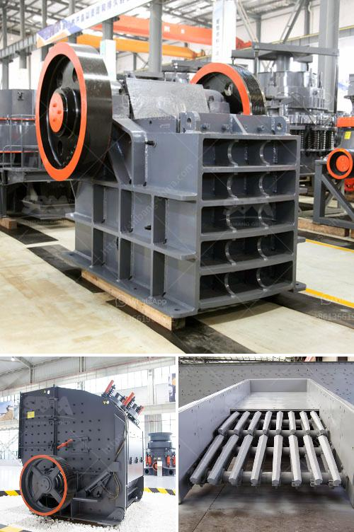

<h3>marble crushing machinery</h3>
Marble, a natural stone formed through the metamorphism of limestone, is one of the most popular materials used in various industries and construction projects. With its elegant appearance, durability, and wide color range, marble has become a go-to choice for countertops, flooring, wall cladding, and more. However, before it can be utilized in such applications, marble needs to go through an essential process known as crushing. This is where marble crushing machinery comes into play.

Marble crushing machinery refers to the equipment used to crush marble stones to meet the required size. The crushed marble pieces are then used for various industrial applications or further processed into different forms. Among the machinery commonly used in marble crushing are jaw crushers, gyratory crushers, cone crushers, impact crushers, and hammer crushers.

Jaw crushers are primarily used for coarse crushing purposes. They are designed to crush marble stones into smaller particles with high crushing ratio and maximum input size of up to 1500mm. Jaw crushers have the advantage of simple structure, reliable performance, easy maintenance, and low operating costs, making them a popular choice for crushing marble.

Gyratory crushers are suitable for crushing hard and abrasive materials, including marble. The working principle of a gyratory crusher involves a concave surface and a conical head. As the materials are crushed by the closing action between the mantle and the concave, they are discharged from the bottom. Gyratory crushers are known for their high capacity and low operating costs.

Cone crushers, on the other hand, are used for intermediate and fine crushing applications. With their ability to crush hard and medium-hard materials, cone crushers are commonly used in the mining and quarrying industry. Cone crushers offer advantages such as high productivity, excellent particle shape, and easy maintenance.

Impact crushers are ideal for processing marble stones with medium hardness. They utilize the impact force to crush the materials and can be used for primary, secondary, or tertiary crushing. Impact crushers have a high crushing ratio and produce cubic-shaped end products. They are suitable for crushing marble stones with a size of up to 500mm.

Lastly, hammer crushers are used for fine crushing or shaping purposes. With their high-speed rotating hammers, they impact the materials and break them into smaller pieces. Hammer crushers are often used to crush marble stones into artificial sand or aggregate for construction purposes.

In conclusion, marble crushing machinery plays a crucial role in the marble industry by efficiently crushing marble stones into smaller particles or shaping them into different forms. Jaw crushers, gyratory crushers, cone crushers, impact crushers, and hammer crushers are the primary machines used for this purpose. Each type of crusher has its own unique features, advantages, and suitability for specific crushing requirements. By employing the appropriate marble crushing machinery, industries can effectively utilize this natural stone and ensure the quality and consistency of their products.
<h3>Contact us</h3><ul><li><strong>Whatsapp:&nbsp;<a href="https://wa.me/8613661969651">+8613661969651</a></strong></li><li><a href="https://swt.shibang-china.com/?git&amp;zhl&amp;marble crushing machinery"><strong>Online Service(chat now)</strong></a></li></ul><h3>Related</h3><ul><li><a href='types of grinding mill.md'>types of grinding mill</a></li><li><a href='concrete grinding machine rental hk.md'>concrete grinding machine rental hk</a></li><li><a href='limestone processing plant philippines.md'>limestone processing plant philippines</a></li><li><a href='complete crusher for sale in ghana.md'>complete crusher for sale in ghana</a></li><li><a href='recycling machines for sale in south africa.md'>recycling machines for sale in south africa</a></li></ul>