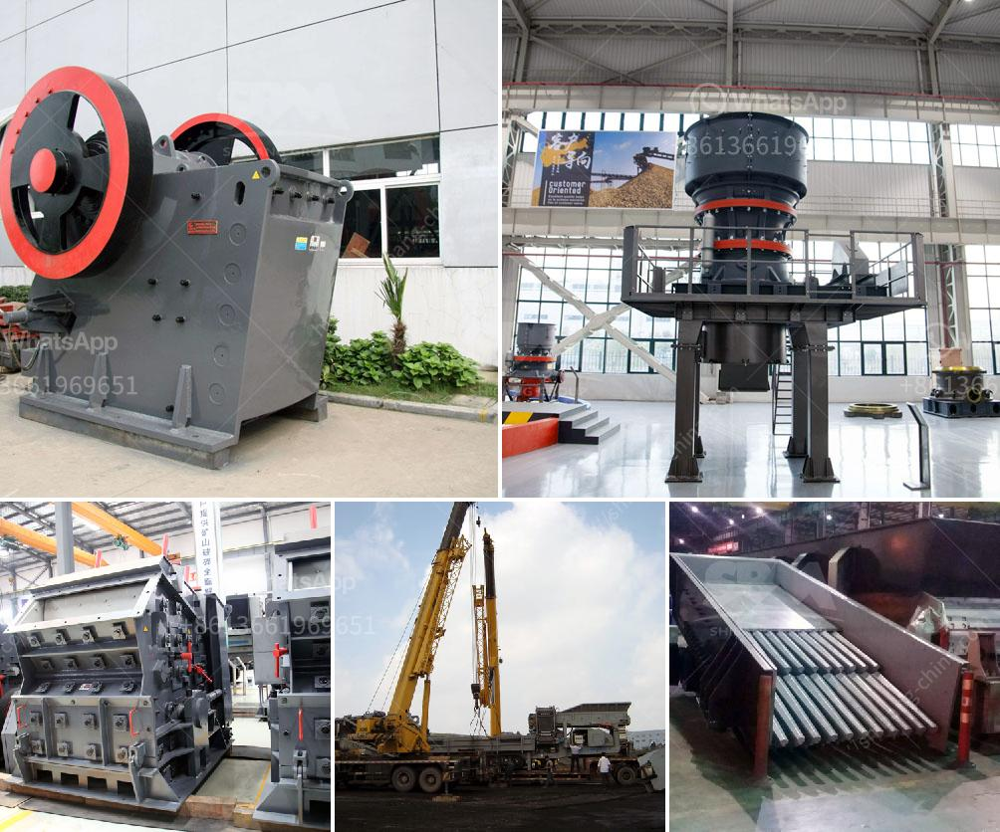

<h3>marble grinding factory in dubai</h3>
When envisioning a luxurious and elegant space, marble surfaces often come to mind. This natural stone has a timeless beauty and adds a touch of sophistication to any space. To achieve that impeccable finish, the expertise of a marble grinding factory is paramount. In Dubai, a city known for its extraordinary architectural wonders, such factories play a pivotal role in turning dreams into reality.

Dubai's marble grinding factories boast cutting-edge technology, skilled craftsmen, and an unparalleled commitment to excellence. They have revolutionized the marble industry by utilizing advanced machinery and techniques that polish, grind, and refine marble surfaces to perfection.

One of the key processes carried out in these factories is grinding. Grinding is essential for giving marble surfaces a stunning smooth finish. It involves the use of specialized equipment, such as diamond abrasive pads and a water cooling system, to grind away irregularities and imperfections in the stone. This meticulous process ensures that the surface remains flat and free of any blemishes.

Moreover, these factories follow strict quality control measures to deliver outstanding results. Each marble slab undergoes a thorough inspection to identify any flaws or defects. This attention to detail ensures that only the finest quality marble is processed, guaranteeing a flawless end product.

Marble grinding factories in Dubai cater to a wide range of clientele, including homeowners, interior designers, architects, and contractors. Whether it's a majestic marble countertop, an exquisite flooring installation, or a grand staircase, they have the expertise to transform any space into a masterpiece.

Additionally, these factories often provide specialized services like marble restoration and maintenance. Over time, marble surfaces may lose their luster due to wear and tear or improper care. The experienced craftsmen in these factories can breathe new life into dull marble surfaces through restoration techniques such as honing, buffing, and polishing. They can also offer guidance on proper maintenance practices to keep marble surfaces looking pristine for years to come.

The marble grinding factories in Dubai have played a significant role in shaping the city's landscape. From iconic hotel lobbies and luxurious residences to commercial spaces and public buildings, the influence of marble can be seen and felt everywhere. These factories have contributed to Dubai's reputation as a global design hub by providing the perfect finishing touch to architectural marvels.

In conclusion, the marble grinding factories in Dubai have revolutionized the marble industry and transformed countless spaces into works of art. Their expertise, cutting-edge technology, and commitment to perfection make them an indispensable part of Dubai's architectural landscape. From grinding and polishing to restoration and maintenance, these factories are well-equipped to bring your marble dreams to life. So, if you're looking to create a space that exudes elegance and sophistication, trust the expertise of Dubai's marble grinding factories.
<h3>Contact us</h3><ul><li><strong>Whatsapp:&nbsp;<a href="https://wa.me/8613661969651">+8613661969651</a></strong></li><li><a href="https://swt.shibang-china.com/?git&amp;zhl&amp;marble grinding factory in dubai"><strong>Online Service(chat now)</strong></a></li></ul><h3>Related</h3><ul><li><a href='concrete stone crusher south africa.md'>concrete stone crusher south africa</a></li><li><a href='compact vibrating ball mill manufactures.md'>compact vibrating ball mill manufactures</a></li><li><a href='coal crushing and washing plant for sale in south africa.md'>coal crushing and washing plant for sale in south africa</a></li><li><a href='granite quarrying companies.md'>granite quarrying companies</a></li><li><a href='crushing and screening process.md'>crushing and screening process</a></li></ul>