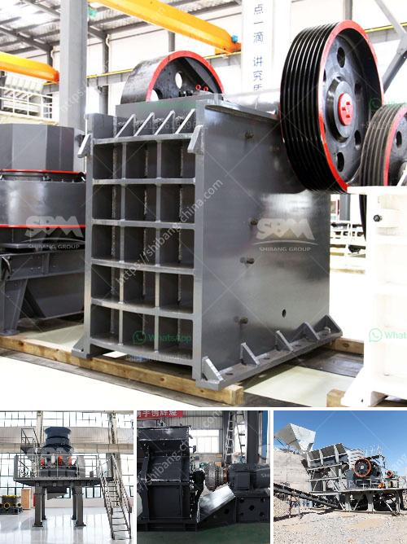

<h3>marble grinding mill process</h3>
Marble is a natural stone that has been used for centuries in various industries and applications. It is prized for its elegance, durability, and versatility. However, before marble can be used in its final form, it undergoes a process called grinding.

The grinding process of marble is essential in bringing out the full beauty of the stone. It involves using a specialized machine to cut and shape the marble into the desired form. This process helps to remove any imperfections or blemishes on the surface of the marble, resulting in a smooth and polished finish.

The first step in the marble grinding process is to prepare the marble surface. This involves cleaning the surface and clearing away any debris or dirt that may be present. Once the surface is clean, the grinding process begins.

A marble grinding mill is used to grind the marble into the desired particle size. This mill consists of a rotating drum with steel balls inside, which grind the marble by impacting and grinding against each other. The marble particles are ground down to a fine powder, which can then be used in various applications.

The grinding process also helps to expose the natural veining and patterns of the marble, enhancing its aesthetic appeal. It brings out the unique characteristics of each slab of marble, making it even more beautiful and striking.

In addition to enhancing the beauty of marble, the grinding process also improves its durability. By removing any surface imperfections, the marble becomes more resistant to wear and tear. This makes it suitable for use in high-traffic areas, such as floors and countertops.

In conclusion, the grinding process is an essential step in bringing out the full potential of marble. It not only improves its appearance but also enhances its durability. Whether used in construction, interior design, or art, marble that has undergone the grinding process is sure to make a lasting impression.
<h3>Contact us</h3><ul><li><strong>Whatsapp:&nbsp;<a href="https://wa.me/8613661969651">+8613661969651</a></strong></li><li><a href="https://swt.shibang-china.com/?git&amp;zhl&amp;marble grinding mill process"><strong>Online Service(chat now)</strong></a></li></ul><h3>Related</h3><ul><li><a href='equipments used in cement industry.md'>equipments used in cement industry</a></li><li><a href='alluvial gold mining process.md'>alluvial gold mining process</a></li><li><a href='by products of limestone processing.md'>by products of limestone processing</a></li><li><a href='caco grinding grinder.md'>caco grinding grinder</a></li><li><a href='coal drying plant manufacture in india.md'>coal drying plant manufacture in india</a></li></ul>