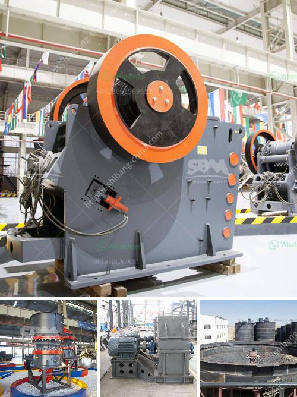

<h3>marble powder grinding plant manufacturer</h3>
When it comes to marble powder, one cannot underestimate the importance of its grinding process. With the increasing demand for fine powder products in various industries, a reliable marble powder grinding plant manufacturer is essential. They provide the necessary machinery and expertise to grind marble stones into a fine powder form.

One such manufacturer that has gained a reputation in the market is renowned for its high-quality grinding plant. They understand the importance of consistency and efficiency in the grinding process. The plant is equipped with advanced machinery and cutting-edge technology to ensure that the marble stones are ground to perfection.

The grinding plant offers a range of grinding mills, including ball mill, Raymond mill, vertical roller mill, high-pressure mill, ultrafine mill, and other equipment. These mills are suitable for processing both dry and wet materials, ensuring the highest quality of finished products. The grinding plant manufacturer also provides customized solutions to meet specific requirements, such as production capacity, fineness, and power consumption.

Another significant advantage of choosing a reliable grinding plant manufacturer is their commitment to environmental sustainability. They adopt eco-friendly measures and use advanced dust removal systems to minimize pollution during the grinding process. This ensures that the plant operates in compliance with environmental regulations, making it a responsible choice for marble stone grinding.

Moreover, a reputable manufacturer provides comprehensive after-sales service, including installation, commissioning, and maintenance support. Their team of experts is readily available to address any queries or issues that may arise during the operation of the grinding plant. This ensures a smooth and hassle-free experience for customers.

In conclusion, when it comes to marble powder grinding, choosing a reliable manufacturer is crucial. They provide the necessary machinery and expertise to grind marble stones into a fine powder form. With their advanced technology, eco-friendly practices, and comprehensive after-sales support, they are the ideal partner for all your grinding needs. So, why wait? Contact a reputable marble powder grinding plant manufacturer today and unlock the maximum potential of your marble stones.
<h3>Contact us</h3><ul><li><strong>Whatsapp:&nbsp;<a href="https://wa.me/8613661969651">+8613661969651</a></strong></li><li><a href="https://swt.shibang-china.com/?git&amp;zhl&amp;marble powder grinding plant manufacturer"><strong>Online Service(chat now)</strong></a></li></ul><h3>Related</h3><ul><li><a href='used stone crushers for sale india.md'>used stone crushers for sale india</a></li><li><a href='how to start a stone quarry business.md'>how to start a stone quarry business</a></li><li><a href='prices of coal pulverizers.md'>prices of coal pulverizers</a></li><li><a href='small ore crusher.md'>small ore crusher</a></li><li><a href='eco stone crusher.md'>eco stone crusher</a></li></ul>