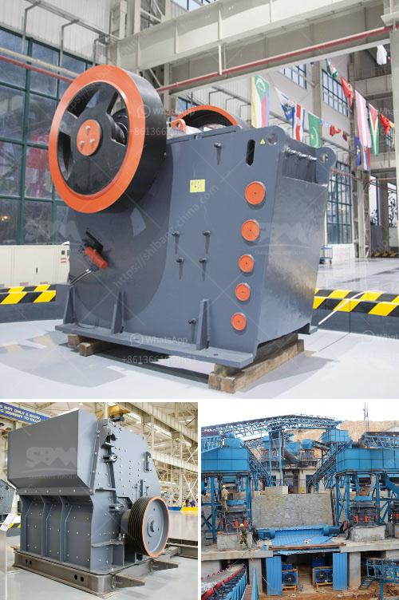

<h3>market analysis of stone crusher</h3>
The stone crusher market in the United States is expected to grow at a steady rate due to the strong demand from the construction industry. The country is one of the leading producers of crushed stone in the world, with substantial amounts of aggregate being used in infrastructure projects. The market for stone crushing machines is heavily dependent on the infrastructure development that is happening throughout the country.

The market analysis of stone crusher shows that the market demand for stone crushers is increasing steadily. The sector is also facing a shortage of raw materials due to decreased production of stone quarries and shortage of crusher machinery, thereby affecting the market growth.

The stone crusher market is divided into many geographic locations based on various factors such as demand, supply chain, and market growth rate. The market is segmented into North America, Europe, Asia-Pacific, South America, and the Middle East and Africa. The regional analysis also includes the key countries in each region that contribute to the market growth.

North America is one of the prominent markets for stone crushers due to the presence of numerous construction and infrastructure development projects. The growth rate in this region is expected to be significant due to the increasing population and rising disposable income levels.

Europe is another key market for stone crushers due to the presence of several stone crushing equipment manufacturers. Additionally, the region is witnessing significant growth in the construction and mining industries, which is driving the demand for stone crushers.

Asia-Pacific is also a major market for stone crushers, with countries like China and India leading the way. These countries have a robust construction industry and are undertaking several infrastructure development projects, thereby boosting the demand for stone crushers.

South America has a substantial market for stone crushers due to the growing requirement for infrastructure development. The region is witnessing a surge in construction activities, thereby driving the demand for stones and aggregates.

The Middle East and Africa region has immense potential for stone crusher market growth. The region is experiencing rapid urbanization and industrialization, which is creating a demand for stone crushers. Additionally, various government initiatives aimed at boosting the infrastructure sector are expected to drive the market growth.

The stone crusher market is highly competitive due to the presence of numerous players. Some of the key players in the market are Metso Corporation, Komatsu Ltd., Caterpillar Inc., Joy Global Inc., Sandvik AB, Terex Corporation, and Thyssenkrupp AG, among others. These players are focusing on expanding their product portfolio through acquisitions, mergers, and partnerships to cater to the growing demand in the market.

In conclusion, the stone crusher market is expected to witness steady growth in the coming years. The increasing demand for stone crushers in various industries such as mining, construction, and infrastructure development is the key factor driving the market growth. Additionally, government initiatives aimed at boosting the infrastructure sector and the presence of established players in the market are further contributing to the growth of the stone crusher market. However, the shortage of raw materials and crusher machinery may hinder the market growth to some extent.
<h3>Contact us</h3><ul><li><strong>Whatsapp:&nbsp;<a href="https://wa.me/8613661969651">+8613661969651</a></strong></li><li><a href="https://swt.shibang-china.com/?git&amp;zhl&amp;market analysis of stone crusher"><strong>Online Service(chat now)</strong></a></li></ul><h3>Related</h3><ul><li><a href='business plan for stone grinding in ethiopia.md'>business plan for stone grinding in ethiopia</a></li><li><a href='used mobile crushing plant trailer.md'>used mobile crushing plant trailer</a></li><li><a href='used portable crushing plant philippines.md'>used portable crushing plant philippines</a></li><li><a href='vertical ball mill technology.md'>vertical ball mill technology</a></li><li><a href='cement ball mill design pdf.md'>cement ball mill design pdf</a></li></ul>