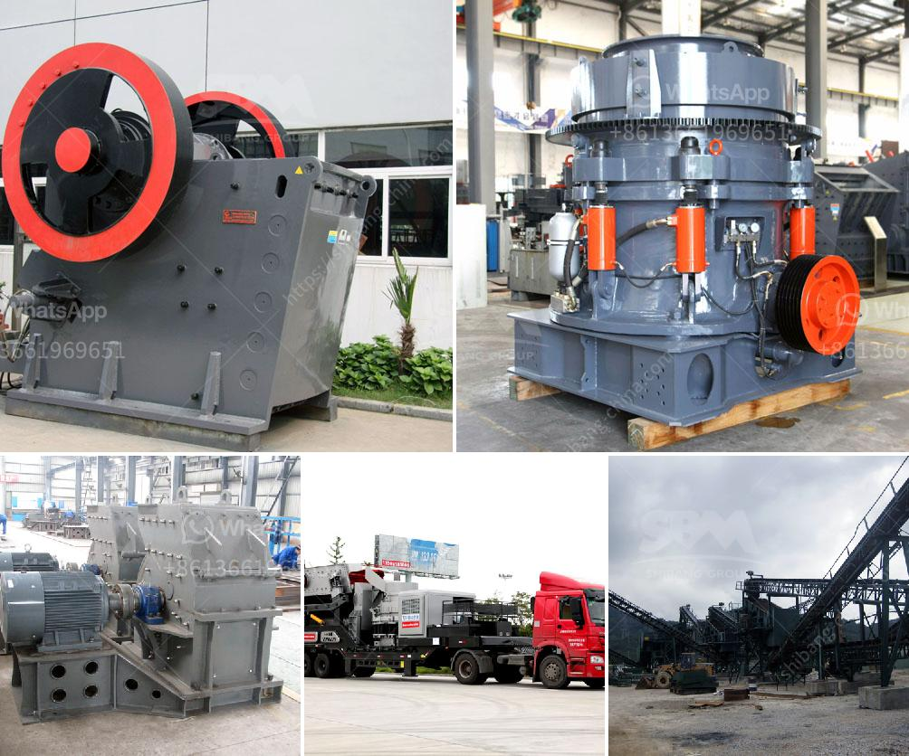

<h3>material using for making talcum powder</h3>
Talcum powder is a popular household product used for various purposes such as absorbing moisture, reducing friction, and preventing rashes. This fine, silky powder is derived from the mineral talc, which is composed of magnesium, silicon, and oxygen. Talcum powder is widely used in personal care products, cosmetics, and even for infant care. However, have you ever wondered about the specific materials and ingredients used in making this versatile powder? In this article, we will explore the primary components used in manufacturing talcum powder.

The main ingredient in talcum powder is talc, a mineral mined primarily in the United States, China, and Western Europe. Talc has been used for centuries due to its remarkable absorbent qualities. The mineral is ground into a fine powder, resulting in the soft, smooth texture that makes talcum powder so desirable.

To make talcum powder, manufacturers often add other ingredients to enhance its properties. One common additive is cornstarch, derived from the endosperm of corn kernels. Cornstarch is not only a natural alternative to talc but also acts as an anti-caking agent by absorbing excess moisture. Its presence in talcum powder helps prevent clumping and keeps the powder free-flowing.

Fragrances are another essential component of talcum powder. They are used to provide a pleasant scent, often a light floral or baby powder fragrance. These fragrances are carefully chosen to ensure that the powder leaves a fresh and comforting smell on the skin. A variety of natural and synthetic fragrances are used in talcum powder to cater to different preferences.

Additionally, talcum powder may contain a small amount of moisturizing agents such as aloe vera or chamomile extracts. These ingredients help to soothe and nourish the skin, adding an extra element of care to the powder. Moisturizers can ease dryness or irritation, making talcum powder a suitable product for individuals with sensitive or delicate skin.

It is worth noting that many manufacturers have recognized the potential risks associated with talcum powder due to its possible contamination with asbestos. As a result, some products have opted for alternatives such as rice starch, tapioca starch, or arrowroot powder, which provide similar properties without the risk of asbestos contamination. These alternatives offer a safe option for those concerned about potential health implications.

In conclusion, talcum powder is predominantly made from talc, a mineral rich in magnesium, silicon, and oxygen. Various additives like cornstarch, fragrance, and moisturizing agents are incorporated to enhance the powder's effectiveness and ensure a pleasant user experience. The manufacturing process involves grinding the talc to a fine texture, resulting in the beloved soft and silky quality of talcum powder. As consumer demand for safer alternatives grows, manufacturers have begun incorporating ingredients such as rice starch or arrowroot powder, providing consumers with a choice that aligns with their safety concerns.
<h3>Contact us</h3><ul><li><strong>Whatsapp:&nbsp;<a href="https://wa.me/8613661969651">+8613661969651</a></strong></li><li><a href="https://swt.shibang-china.com/?git&amp;zhl&amp;material using for making talcum powder"><strong>Online Service(chat now)</strong></a></li></ul><h3>Related</h3><ul><li><a href='cost of crushing and screening.md'>cost of crushing and screening</a></li><li><a href='grinding machine for white clay in india.md'>grinding machine for white clay in india</a></li><li><a href='quarry crusher equipments for sale in ibadan nigeria.md'>quarry crusher equipments for sale in ibadan nigeria</a></li><li><a href='coal crushing and screening plant.md'>coal crushing and screening plant</a></li><li><a href='flowsheet for crushing plant.md'>flowsheet for crushing plant</a></li></ul>