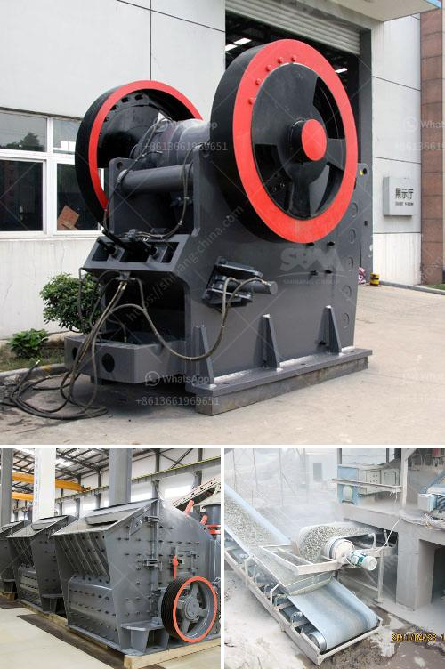

<h3>mica mill roller mill</h3>
Mica is a naturally occurring mineral renowned for its unique physical properties and extensive use in various industries. To make the most of its versatile applications, manufacturers rely on advanced processing technologies. Among the leading options is the Mica Mill Roller Mill, an innovative machine designed to efficiently grind mica into fine powder. In this article, we will discuss the advantages and features of the Mica Mill Roller Mill, highlighting its contribution to enhancing mica processing efficiency.

The Mica Mill Roller Mill adopts a high-pressure grinding roller structure that efficiently compresses the material between rollers, significantly increasing the grinding area. As a result, the roller mill can achieve finer and more uniform particle sizes. This enhanced grinding efficiency allows manufacturers to optimize their mica processing operations, reducing production time and costs.

The Mica Mill Roller Mill features automatic material feeding and precise control of the feeding speed, ensuring a constant and steady flow of mica into the grinding area. This automated process eliminates the need for manual intervention, making the machine ideal for continuous processing operations. By streamlining the material handling process, manufacturers can achieve higher production rates while maintaining consistent quality.

With the Mica Mill Roller Mill, mica can be ground into various particle sizes ranging from fine powders suitable for cosmetics and paints to coarser grades preferred for industrial applications. This versatility allows manufacturers to cater to a wide range of customer needs, ensuring optimal product functionality and performance in different industries.

The Mica Mill Roller Mill is designed with energy efficiency in mind. With advanced grinding technology, it minimizes energy consumption, translating into lower operating costs for manufacturers. Additionally, the roller mill operates at lower noise levels compared to traditional grinding equipment, creating a more pleasant working environment for operators. Moreover, its enclosed structure helps contain dust emissions, making it environmentally friendly.

The Mica Mill Roller Mill is engineered for durability and longevity. Constructed with high-quality materials and components, it ensures a prolonged service life even under demanding manufacturing conditions. Furthermore, the roller mill requires minimal maintenance, reducing downtime and enhancing overall productivity.

The Mica Mill Roller Mill represents a significant technological advancement in mica processing. Combining enhanced grinding efficiency, automated material handling, versatile application possibilities, energy efficiency, and reliability, the roller mill enables manufacturers to unlock the full potential of mica. With its superior capabilities, this machine contributes to improving productivity, reducing costs, and meeting the diverse needs of various industries that rely on mica. As mica continues to be in high demand, the Mica Mill Roller Mill offers a valuable solution for manufacturers seeking to maximize their production capacity and operational efficiency.
<h3>Contact us</h3><ul><li><strong>Whatsapp:&nbsp;<a href="https://wa.me/8613661969651">+8613661969651</a></strong></li><li><a href="https://swt.shibang-china.com/?git&amp;zhl&amp;mica mill roller mill"><strong>Online Service(chat now)</strong></a></li></ul><h3>Related</h3><ul><li><a href='gyratory crusher harga.md'>gyratory crusher harga</a></li><li><a href='quarry crushing equipment.md'>quarry crushing equipment</a></li><li><a href='grinding mill material.md'>grinding mill material</a></li><li><a href='cost of building calcium carbonate factory.md'>cost of building calcium carbonate factory</a></li><li><a href='gravel production line.md'>gravel production line</a></li></ul>