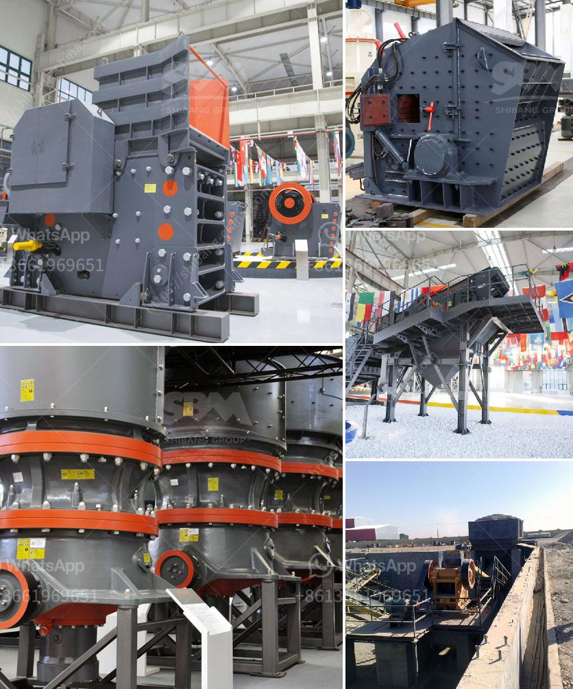

<h3>mill ball grinding ball mills</h3>
Mill ball grinding ball mills are widely used in mining, smelting, building materials, roads, railways, water conservancy, and chemical industries. They are an essential tool for grinding different types of materials into fine powder or paste. The main components of a ball mill include a cylindrical shell, grinding medium (such as steel balls), and a motor that rotates the shell.

One of the significant advantages of mill ball grinding ball mills is their versatility. They can grind a wide range of materials, including ore, limestone, cement clinker, and coal. This versatility enables them to be used in various applications, such as ore beneficiation, cement production, and pharmaceutical industries.

The process of grinding in ball mills involves the collision and impact among the grinding medium and the material being ground. As the mill rotates, the grinding medium, typically steel balls, tumble and crush the material into a fine powder. The grinding medium also helps to grind the material by applying pressure.

The efficiency of mill ball grinding ball mills highly depends on the selection of grinding medium. The size and composition of the grinding medium can significantly affect the grinding performance. For instance, larger grinding media can deliver more impact force, resulting in faster and more efficient grinding. The choice of grinding medium should be based on the specific requirements of the material being ground.

In recent years, there have been advancements in mill ball grinding ball mills. For example, some ball mills incorporate a second-stage grinding system, such as a vertical roller mill, to further enhance the grinding efficiency. Additionally, innovative designs have been introduced to improve the ease of operation, reduce maintenance requirements, and increase the overall energy efficiency.

In conclusion, mill ball grinding ball mills are a crucial piece of equipment for various industries. Their versatility, efficiency, and ability to grind different materials make them indispensable for many applications. With ongoing advancements, these mills continue to play a vital role in the processing of various materials, improving productivity, and enhancing overall operational efficiency.
<h3>Contact us</h3><ul><li><strong>Whatsapp:&nbsp;<a href="https://wa.me/8613661969651">+8613661969651</a></strong></li><li><a href="https://swt.shibang-china.com/?git&amp;zhl&amp;mill ball grinding ball mills"><strong>Online Service(chat now)</strong></a></li></ul><h3>Related</h3><ul><li><a href='output size for a jaw crusher.md'>output size for a jaw crusher</a></li><li><a href='process of limestone crusher.md'>process of limestone crusher</a></li><li><a href='stone crusher plant south africa.md'>stone crusher plant south africa</a></li><li><a href='100 tpd kiln project cost.md'>100 tpd kiln project cost</a></li><li><a href='crusher plant in rajasthan.md'>crusher plant in rajasthan</a></li></ul>