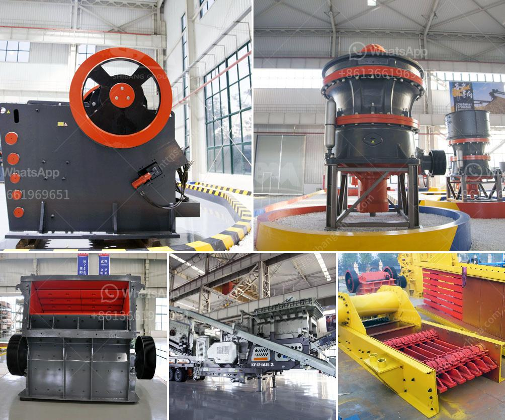

<h3>mill for grinding quartz</h3>
Quartz is one of the most abundant minerals on Earth. It has a hardness of 7 on the Mohs scale, making it a durable and long-lasting material. However, processing quartz into a powder form can be a challenging process due to its high resistance to abrasion. This is where a mill for grinding quartz comes into play.

A mill for grinding quartz utilizes metal balls in a rotating drum to powder the substance. The mill works on the principle of impact and attrition: the size reduction is done by impact as the balls drop from near the top of the shell. A rotating drum throws larger rocks of quartz into a cataracting motion, causing impact and grinding between the balls and the quartz particles.

One of the main advantages of using a mill for grinding quartz is its efficiency and low energy consumption. The grinding process is continuous and the quartz powder is produced in a high yield. Additionally, the mill can be operated at high rotational speeds, allowing for a fine and uniform powder to be achieved.

Different types of mills can be used for grinding quartz, such as ball mills, hammer mills, and vertical roller mills. Each mill has its own set of parameters and considerations when it comes to grinding efficiency, power consumption, and product quality.

Ball mills are commonly used for grinding quartz. They provide a relatively large grinding surface area, making them suitable for both dry and wet grinding processes. The grinding balls in a ball mill are usually made of steel or ceramic materials. The size of the balls and the rotation speed of the mill determine the fineness of the powder produced.

Hammer mills are another option for grinding quartz. They operate by rotating a series of hammers at high speed, causing the quartz to be shattered. Hammer mills are commonly used for coarse grinding applications where a large amount of material needs to be reduced in size.

Vertical roller mills are a more recent development in the grinding of quartz. They consist of a rotating table onto which the quartz is fed from above. The material is ground between the table and rollers, resulting in a fine powder. Vertical roller mills are known for their high grinding efficiency and low power consumption.

In conclusion, mills for grinding quartz play a crucial role in the processing of this mineral. They provide an efficient and cost-effective method for reducing quartz into a powder form that is used in various industries such as ceramics, glass, and electronics. With advancements in technology, different types of mills are now available, allowing for precise control over the grinding process. Whether it is a ball mill, hammer mill, or vertical roller mill, the objective remains the same: to produce high-quality quartz powder efficiently and economically.
<h3>Contact us</h3><ul><li><strong>Whatsapp:&nbsp;<a href="https://wa.me/8613661969651">+8613661969651</a></strong></li><li><a href="https://swt.shibang-china.com/?git&amp;zhl&amp;mill for grinding quartz"><strong>Online Service(chat now)</strong></a></li></ul><h3>Related</h3><ul><li><a href='coal crushing and screening plant for sale south africa.md'>coal crushing and screening plant for sale south africa</a></li><li><a href='talc mining crusher costs.md'>talc mining crusher costs</a></li><li><a href='cement plant process flow diagram ppt.md'>cement plant process flow diagram ppt</a></li><li><a href='rock crushers manufacturers.md'>rock crushers manufacturers</a></li><li><a href='calcium ball mill.md'>calcium ball mill</a></li></ul>