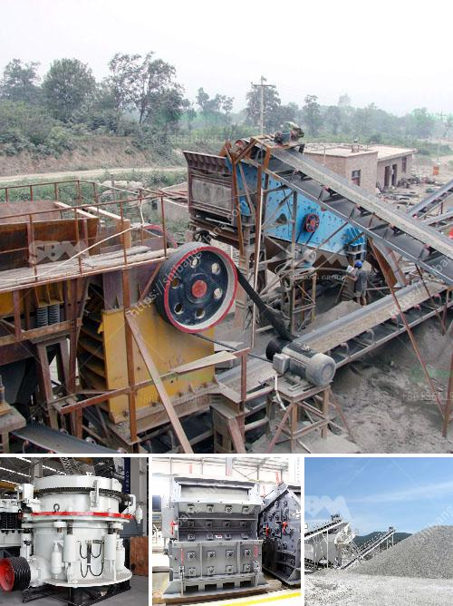

<h3>mill grinding machine for sale</h3>
Mill grinding machines are essential equipment in many industries, ranging from mining to construction. These machines are used to grind and crush materials into smaller particles, allowing for easier processing. If you are in the market for a mill grinding machine for sale, this article will provide you with all the information you need to make an informed decision.

One of the primary advantages of using a mill grinding machine is the ability to produce uniform and finely ground particles. These machines use mechanical force to break down the materials, resulting in consistent particle sizes. This is particularly important in industries such as pharmaceuticals and food processing, where particle size control is critical for product quality.

Another benefit of using a mill grinding machine is its versatility. These machines can be used to grind a wide range of materials, including minerals, ores, chemicals, and even certain types of organic matter. The ability to handle different materials makes these machines highly desirable for a variety of industries.

When purchasing a mill grinding machine, there are several factors to consider. First and foremost, you need to determine the specific application and requirements of your business. This will help you narrow down your options and find a machine that meets your needs. It is also essential to consider the capacity and power requirements of the machine, as well as its maintenance and operating costs.

There are various types of mill grinding machines available on the market, each with its own unique features and benefits. The most common types include ball mills, rod mills, and autogenous mills. Ball mills use steel balls as grinding media, while rod mills use rods. Autogenous mills, on the other hand, do not require additional grinding media, as the materials themselves act as the grinding media.

When looking for a mill grinding machine for sale, it is crucial to consider the reputation and reliability of the manufacturer. You want to purchase your machine from a trusted and established company that has a track record of producing high-quality equipment. It is also advisable to read customer reviews and testimonials to gain insights into the performance and durability of the machine.

In addition to considering the manufacturer, it is recommended to compare prices from different suppliers. While price should not be the sole determining factor, it is essential to ensure that you are getting the best value for your money. Keep in mind that cheaper machines may not always offer the same level of durability and performance as more expensive ones.

To conclude, purchasing a mill grinding machine requires careful consideration and research. By understanding your specific requirements and comparing different options, you can find a machine that meets your needs and budget. Remember to choose a reputable manufacturer and compare prices from multiple suppliers to ensure you are making an informed decision. A mill grinding machine can greatly enhance your business's productivity and efficiency, making it a worthwhile investment.
<h3>Contact us</h3><ul><li><strong>Whatsapp:&nbsp;<a href="https://wa.me/8613661969651">+8613661969651</a></strong></li><li><a href="https://swt.shibang-china.com/?git&amp;zhl&amp;mill grinding machine for sale"><strong>Online Service(chat now)</strong></a></li></ul><h3>Related</h3><ul><li><a href='small size mobile ore crushers.md'>small size mobile ore crushers</a></li><li><a href='crusher machine in bhutan.md'>crusher machine in bhutan</a></li><li><a href='principle of cone crusher.md'>principle of cone crusher</a></li><li><a href='portable ballast crusher for sale.md'>portable ballast crusher for sale</a></li><li><a href='conveyor belts for shelves.md'>conveyor belts for shelves</a></li></ul>