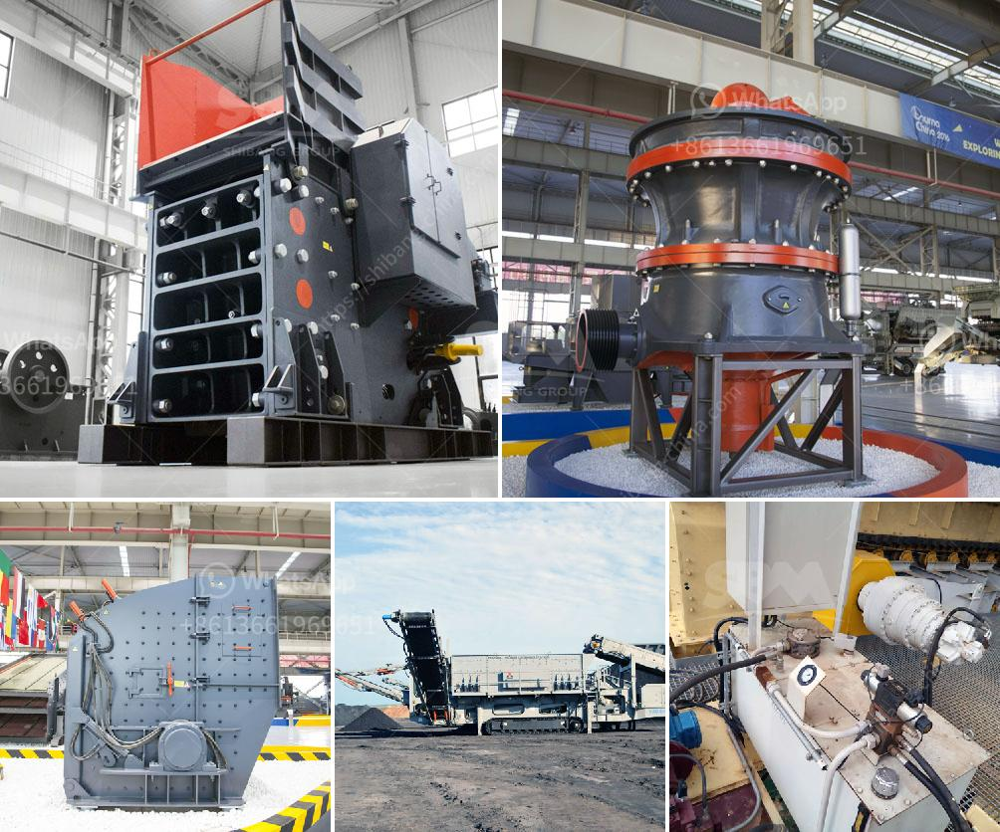

<h3>mill grinding plants balls</h3>
Grinding is an essential process in many industries, particularly in the mineral processing sector, where substances need to be reduced in size for further processing or extraction. The success of grinding operations relies on the use of the right equipment, including mill grinding plant balls. These small spheres play a crucial role in enhancing the efficiency of the grinding process, ensuring optimal particle size distribution and maximizing material recovery.

Mill grinding plant balls, also known as grinding media, are used in ball mills, semi-autogenous mills, and autogenous mills to pulverize material into fine particles. They are typically made of steel, alloyed with other elements such as chromium, to enhance their hardness and resistance to wear and corrosion. Some manufacturers also offer grinding balls made of ceramic or other materials, with specific properties for particular applications.

The primary function of mill grinding plant balls is to effectively break down the material being ground, whether it is ore, cement, coal, or any other substance. This is achieved through a combination of impact and abrasion caused by the motion of the balls within the mill. As the mill rotates, the grinding balls cascade and tumble onto the material, crushing and reducing it in size. The finer the material needs to be ground, the smaller the grinding balls used, ensuring maximum surface contact and increasing the likelihood of particle size reduction.

Another critical aspect of mill grinding plant balls is their size, shape, and composition. These characteristics significantly influence the overall grinding efficiency and final product quality. Grinding balls come in various diameters, typically ranging from 20mm to 150mm, depending on the type of mill and material being processed. Smaller balls provide higher grinding efficiency due to increased surface area, while larger balls are used for coarse grinding or in larger mills where impact is the primary mode of grinding.

The composition of mill grinding plant balls is also vital for optimal performance. Different industries have diverse requirements, and manufacturers provide a range of grinding media options suitable for specific applications. For example, in the mining industry, where grinding balls are heavily utilized, high-chrome balls are often preferred due to their exceptional wear resistance and durability. Additionally, the high density of these balls allows for more energy-efficient grinding.

In recent years, the development of new materials and manufacturing techniques has further improved grinding ball performance. For instance, advancements in heat treatment processes have allowed for superior hardness and toughness, extending the lifespan of grinding balls in the most demanding grinding applications. Similarly, advancements in forging and rolling technologies have significantly enhanced the roundness and surface quality of grinding balls, resulting in improved grinding efficiency.

In conclusion, mill grinding plant balls are a critical component for efficient grinding operations. Their size, shape, and composition directly impact the grinding process, influencing particle size reduction, material recovery, and overall productivity. Investing in high-quality grinding balls suitable for the specific application is essential for maximizing grinding efficiency and reducing downtime. As industries continue to evolve and demand finer grinding, ongoing research and development in grinding ball technology will play a crucial role in driving further optimization of grinding processes.
<h3>Contact us</h3><ul><li><strong>Whatsapp:&nbsp;<a href="https://wa.me/8613661969651">+8613661969651</a></strong></li><li><a href="https://swt.shibang-china.com/?git&amp;zhl&amp;mill grinding plants balls"><strong>Online Service(chat now)</strong></a></li></ul><h3>Related</h3><ul><li><a href='controlling parameter of impact crusher.md'>controlling parameter of impact crusher</a></li><li><a href='types conveyor belts.md'>types conveyor belts</a></li><li><a href='vertical ball mill technology.md'>vertical ball mill technology</a></li><li><a href='raymod 5 roller mill for pulverizing unit.md'>raymod 5 roller mill for pulverizing unit</a></li><li><a href='ball mills vietnam.md'>ball mills vietnam</a></li></ul>