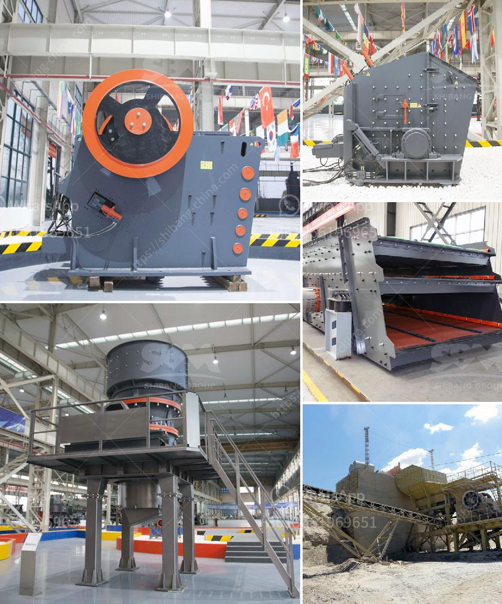

<h3>mineral industrial crusher</h3>
The mining industry is a vital economic sector worldwide. The process of mining extracts valuable minerals and other geological materials from the earth's surface, making them crucial for numerous industrial applications. However, mining operations require heavy-duty machinery to extract, process, and refine the minerals efficiently. This is where the mineral industrial crusher plays a significant role.

A mineral industrial crusher is a machine designed to reduce large rocks into smaller rocks, gravel, or rock dust for industrial use. It works on the principle of impact and attrition, which allows it to transform the extracted minerals into more manageable sizes. These crushers are equipped with strong and durable surfaces, making them capable of handling the harshest mining conditions.

The primary function of a mineral industrial crusher is to break down the minerals into smaller pieces that can be easily transported and further processed. This crushing process ensures that the minerals are adequately prepared for subsequent stages such as grinding, sorting, and refining. Moreover, these crushers can handle a wide range of minerals, including coal, limestone, gypsum, and ores such as iron, copper, and gold.

The use of mineral industrial crushers has revolutionized the mining industry in several ways. Firstly, it significantly increases productivity and efficiency by reducing the size of the materials. This enables mining companies to extract a higher quantity of minerals within a shorter timeframe. Additionally, the smaller particle size obtained after crushing enhances the downstream processes, resulting in improved overall mineral recovery rates.

Furthermore, mineral industrial crushers are built to withstand extreme conditions commonly encountered in mining operations. They are designed with heavy-duty components, robust construction, and high-quality materials, ensuring longevity and reduced downtime. This durability translates into cost savings for mining companies as they can rely on these crushers to perform consistently in harsh environments.

In conclusion, mineral industrial crushers have become an essential part of the mining industry. Their ability to reduce the size of extracted minerals efficiently and withstand challenging conditions make them indispensable for maximizing productivity and profitability. As the mining industry continues to evolve, mineral industrial crushers will undoubtedly play a crucial role in driving its advancement forward.
<h3>Contact us</h3><ul><li><strong>Whatsapp:&nbsp;<a href="https://wa.me/8613661969651">+8613661969651</a></strong></li><li><a href="https://swt.shibang-china.com/?git&amp;zhl&amp;mineral industrial crusher"><strong>Online Service(chat now)</strong></a></li></ul><h3>Related</h3><ul><li><a href='processing of cement crusher.md'>processing of cement crusher</a></li><li><a href='picture of silica sand process plant.md'>picture of silica sand process plant</a></li><li><a href='aggregate washing plant saudi arabia.md'>aggregate washing plant saudi arabia</a></li><li><a href='granite rock breaking machine manufacturer in mlaysia.md'>granite rock breaking machine manufacturer in mlaysia</a></li><li><a href='lime stone screw conveyor.md'>lime stone screw conveyor</a></li></ul>