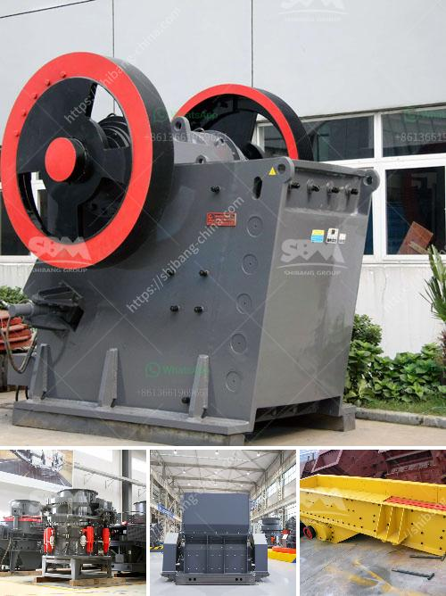

<h3>mineral plant bauxite ore crushing plant</h3>
Bauxite ore, derived from the Earth's crust, is processed to extract valuable minerals and metals such as aluminum. As a primary source for aluminum production, bauxite ore is of immense importance for various industries. In this article, we will explore the bauxite ore crushing plant and its significance in the mineral processing industry.

Bauxite, the primary source of aluminum, is extracted from the earth's crust through various mining techniques, primarily open-pit mining. The ore is then refined through a series of beneficiation steps to yield alumina, which is further processed into aluminum metal. However, before these refining steps can take place, bauxite ore needs to be crushed.

The bauxite ore crushing plant plays a crucial role in the aluminum manufacturing process as it turns the ore into smaller particles that are suitable for refining. Jaw crushers are primary crushers used in bauxite plants and are designed to handle large-sized bauxite ore. The crushing chamber of the jaw crusher consists of two jaws, one fixed and another moving, along a specific trajectory. The ore is fed into the crushing chamber and crushed between these two jaws, reducing the size of the ore particles.

The crushed bauxite ore is then transferred to a vibrating screen for further classification. The oversized material is returned to the crusher for re-crushing, while the undersized material passes through the screen and is separated into different fractions based on the desired size. The classified fractions are then ready for further processing.

Bauxite ore crushing plants are typically equipped with various crushing and screening equipment such as feeders, conveyors, and vibrating screens. These machines work together to achieve the desired bauxite particle size for efficient alumina extraction. Additionally, some plants may incorporate secondary and tertiary crushing stages to further reduce the size of the ore.

Apart from crushing, the bauxite ore crushing plant also plays a vital role in ensuring the sustainability of the mining operation. By reducing the size of the ore, energy and resources are optimized, thereby maximizing the overall efficiency of the operation. This not only helps to minimize operational costs but also reduces the environmental impact associated with mining activities.

In conclusion, the bauxite ore crushing plant is a critical process for the extraction of valuable minerals and metals, particularly aluminum. It reduces the size of the ore for efficient alumina extraction while optimizing the use of energy and resources. Furthermore, it plays a pivotal role in promoting sustainable mining practices by minimizing operational costs and reducing environmental impacts. The continuous advancements in crusher technology and equipment design further enhance the efficiency and effectiveness of bauxite ore crushing plants, making them an essential component in the mineral processing industry.
<h3>Contact us</h3><ul><li><strong>Whatsapp:&nbsp;<a href="https://wa.me/8613661969651">+8613661969651</a></strong></li><li><a href="https://swt.shibang-china.com/?git&amp;zhl&amp;mineral plant bauxite ore crushing plant"><strong>Online Service(chat now)</strong></a></li></ul><h3>Related</h3><ul><li><a href='100 per ton coal crush and screen plant.md'>100 per ton coal crush and screen plant</a></li><li><a href='self healing process of limestone.md'>self healing process of limestone</a></li><li><a href='50tph stone crusher in germany.md'>50tph stone crusher in germany</a></li><li><a href='stone crusher second hand south africa.md'>stone crusher second hand south africa</a></li><li><a href='grinding mills in china.md'>grinding mills in china</a></li></ul>