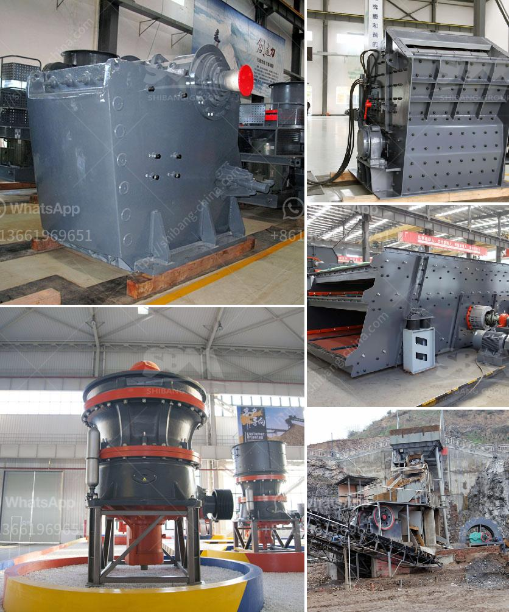

<h3>mineral powder machine</h3>
The processing industry has witnessed remarkable advancements over the years, with the introduction of mineral powder machines being one of the most significant. These machines have revolutionized the way minerals are processed, making the entire process faster, more efficient, and highly precise.

Mineral powder machines are used to crush, grind, and classify minerals into fine powders. They have become essential in various industries, including mining, metallurgy, chemicals, construction, and ceramics. Before the advent of these machines, mineral processing was a tedious and time-consuming task, often involving manual labor and multiple stages of processing.

One of the key advantages of a mineral powder machine is its ability to achieve a high level of fineness in the final product. The machine's grinding mechanism is designed to crush minerals into tiny particles, ensuring that the powder produced is of the desired quality and consistency. This fineness is crucial in industries like cosmetics, where mineral powders are widely used for their smooth texture and excellent coverage.

Furthermore, mineral powder machines come equipped with advanced technologies that ensure precise and uniform grading of minerals. These machines use screens or air classifiers, which separate the mineral particles based on their sizes. This ensures that the final product meets specific size requirements, making it suitable for various applications. For example, in the construction industry, the particle size of mineral powders determines their suitability for filling voids or acting as binding agents.

Another significant advantage of mineral powder machines is their ability to process a wide range of minerals. From limestone to quartz and from talc to clay, these machines can handle various types of minerals, thanks to their robust construction and efficient design. This versatility makes them indispensable in industries that rely heavily on mineral-derived products, such as paints, coatings, and plastics.

In addition to their processing capabilities, mineral powder machines have also contributed to a more sustainable and environmentally friendly approach to mineral processing. Before the introduction of these machines, traditional processing techniques generated a significant amount of waste, posing environmental risks. However, mineral powder machines minimize waste generation and ensure that all valuable mineral resources are efficiently utilized.

Moreover, these machines are designed with energy efficiency in mind. Advanced grinding mechanisms and intelligent controls reduce energy consumption, resulting in lower operational costs and a reduced carbon footprint. As industries strive for greener alternatives, mineral powder machines have emerged as a sustainable solution for the processing industry.

In conclusion, mineral powder machines have transformed the processing industry, enabling faster, more precise, and environmentally friendly mineral processing. Their ability to achieve fine particle sizes, precise grading, and process various minerals has made them indispensable in a wide range of industries. Additionally, their sustainability and energy efficiency make them a preferred choice for companies striving to reduce their environmental impact. As technology continues to advance, we can expect even more innovative developments in mineral powder machines, further enhancing efficiency and productivity in the processing industry.
<h3>Contact us</h3><ul><li><strong>Whatsapp:&nbsp;<a href="https://wa.me/8613661969651">+8613661969651</a></strong></li><li><a href="https://swt.shibang-china.com/?git&amp;zhl&amp;mineral powder machine"><strong>Online Service(chat now)</strong></a></li></ul><h3>Related</h3><ul><li><a href='cone crusher in the philippines.md'>cone crusher in the philippines</a></li><li><a href='aggregate crushers south africa.md'>aggregate crushers south africa</a></li><li><a href='cost of a silica crusher.md'>cost of a silica crusher</a></li><li><a href='company that sells vibratory sieves in spain.md'>company that sells vibratory sieves in spain</a></li><li><a href='machinery conveyor belts.md'>machinery conveyor belts</a></li></ul>