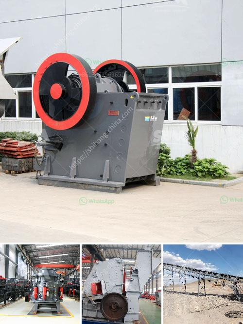

<h3>minerals separation and concentration plant in nigeria</h3>
Nigeria is a country blessed with a variety of mineral resources, including solid minerals, which form the basis of the nation's industrial development. Mineral resources are crucial to the economic and industrial development of any country. They provide the necessary raw materials for the production of a wide range of products and contribute to the country's Gross Domestic Product (GDP).

One critical aspect of mineral resource exploitation is the separation and concentration of minerals. This process involves extracting valuable minerals from their natural ores and concentrating them into a form that can be easily utilized by industries. A minerals separation and concentration plant is a facility where this process takes place.

In Nigeria, there are various minerals separation and concentration plants spread across the country. These plants play a vital role in ensuring the optimal utilization of Nigeria's mineral resources. They employ sophisticated techniques and equipment to extract and concentrate minerals, thus enhancing their value and increasing their economic importance.

One prominent minerals separation and concentration plant in Nigeria is the Tin Mining and Processing Plant (TMP) located in Jos, Plateau State. Tin ore is one of the main minerals mined in Nigeria, and the TMP is responsible for the extraction, refining, and concentration of tin from its ores. This plant employs various processes, including crushing, grinding, magnetic separation, and flotation, to separate and concentrate tin minerals.

Another significant minerals separation and concentration plant in Nigeria is the coal beneficiation plant located in Enugu, Enugu State. Coal is one of Nigeria's abundant natural resources, and the coal beneficiation plant is responsible for separating and concentrating coal minerals from impurities. This process involves washing, crushing, and gravity separation to obtain clean coal that can be used for various industrial purposes.

The minerals separation and concentration plants in Nigeria not only contribute to the country's industrial development but also provide employment opportunities for the local population. These plants require skilled manpower to operate and maintain the sophisticated machinery and equipment used in the separation and concentration processes. Therefore, they offer job opportunities and income generation for many Nigerians, helping to alleviate poverty and improve living standards.

Furthermore, the presence of minerals separation and concentration plants in Nigeria attracts foreign investment and fosters collaboration with international mining companies. These plants provide a favorable environment for foreign investors to explore and harness Nigeria's mineral resources, contributing to technological transfer, capacity building, and economic growth.

In conclusion, minerals separation and concentration plants in Nigeria play a crucial role in the optimum utilization of the country's abundant mineral resources. They extract valuable minerals from their ores and concentrate them into a form that can be easily utilized by industries. These plants not only contribute to industrial development but also provide employment opportunities and attract foreign investment. Therefore, it is essential to support and promote the growth of minerals separation and concentration plants in Nigeria to maximize the benefits derived from the country's mineral resources.
<h3>Contact us</h3><ul><li><strong>Whatsapp:&nbsp;<a href="https://wa.me/8613661969651">+8613661969651</a></strong></li><li><a href="https://swt.shibang-china.com/?git&amp;zhl&amp;minerals separation and concentration plant in nigeria"><strong>Online Service(chat now)</strong></a></li></ul><h3>Related</h3><ul><li><a href='small washing plants diamonds.md'>small washing plants diamonds</a></li><li><a href='buy quarry machine from europe.md'>buy quarry machine from europe</a></li><li><a href='cost of an copper ore crusher.md'>cost of an copper ore crusher</a></li><li><a href='process of limestone crusher.md'>process of limestone crusher</a></li><li><a href='gold mill tailings processing equipment.md'>gold mill tailings processing equipment</a></li></ul>