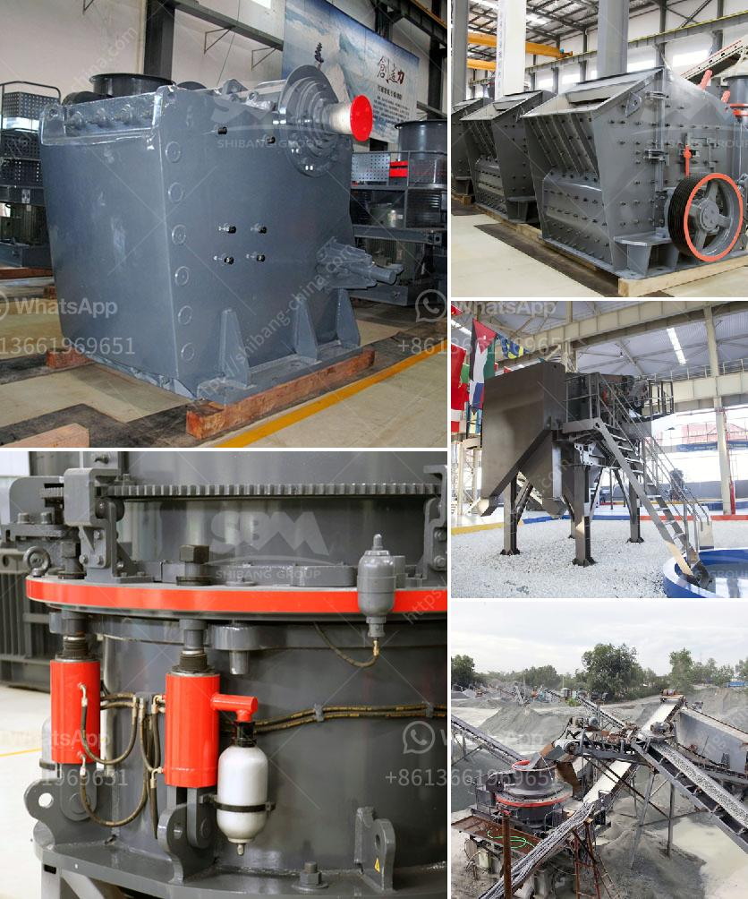

<h3>mini ball mill crusher</h3>
Mini ball mill crusher, also known as small scale crusher, is a powerful mill that is used for crushing hard and solid materials. This mill is multipurpose as it can be used for grinding, crushing and mixing materials for a variety of applications. It is widely used in various industries such as cement, mineral processing, metallurgy, chemical, power and grain industries.

A mini ball mill crusher works on the principle of impact and attrition. Size reduction is done by impact as the balls drop from near the top of the shell. A ball mill consists of a hollow cylindrical shell rotating about its axis. The axis of the shell may be horizontal or at a small angle to the horizontal. The grinding media are the balls, which may be made of steel, stainless steel, ceramic, or rubber. The inner surface of the cylindrical shell is usually lined with an abrasion-resistant material such as manganese steel or rubber. The length of the mill is approximately equal to its diameter.

The mini ball mill crusher is a vital tool for regrinding crushed materials. These machines are used to grind or mix metals or raw materials for further processing. Various materials are placed into the mill drum and rotated with the mined materials that are to be crushed. The output is then screened and separated, with the required particle size represented by the meshes of the screen.

Mini ball mill crushers have many advantages. Firstly, they are cost-effective and require low capital investment. They are suitable for both wet and dry grinding, making them versatile equipment for a wide range of applications. Additionally, mini ball mill crushers have a small footprint and can be easily transported to different locations. They are also energy efficient, as they do not require large amounts of power to operate. Furthermore, they are relatively easy to maintain and have a long service life.

These crushers can be used to crush a variety of materials, including ores, chemicals and ceramic raw materials. The high crushing force generated by the rotating steel balls ensures effective and efficient reduction of particle size. This makes them particularly suitable for grinding or pulverizing materials such as minerals, ores, chemicals, ceramic raw materials, and paints.

In conclusion, mini ball mill crushers are a versatile and cost-effective tool for many industries. They offer a compact and efficient solution for materials grinding and crushing, making them an essential piece of equipment in any processing plant. Whether it is for grinding, crushing or mixing, these crushers deliver high-quality results. With their small footprint and ease of use, they can be transported to any location and offer reliable performance. If you are in need of efficient and cost-effective materials grinding and crushing, consider investing in a mini ball mill crusher.
<h3>Contact us</h3><ul><li><strong>Whatsapp:&nbsp;<a href="https://wa.me/8613661969651">+8613661969651</a></strong></li><li><a href="https://swt.shibang-china.com/?git&amp;zhl&amp;mini ball mill crusher"><strong>Online Service(chat now)</strong></a></li></ul><h3>Related</h3><ul><li><a href='malaysia conveyor belts price.md'>malaysia conveyor belts price</a></li><li><a href='cost of a silica crusher.md'>cost of a silica crusher</a></li><li><a href='used sand screen in south africa sale.md'>used sand screen in south africa sale</a></li><li><a href='wet process cement.md'>wet process cement</a></li><li><a href='companies that manufacture ball mill.md'>companies that manufacture ball mill</a></li></ul>