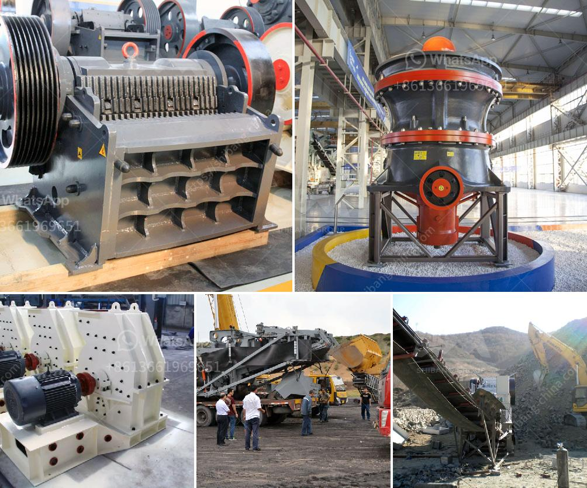

<h3>mini cement plant project report</h3>
A mini cement plant project report is an important document for potential investors and entrepreneurs who are seeking to establish a mini cement plant. The report highlights the market potential, manufacturing process, profitability, project cost, and key success factors of the project.

A mini cement plant is a small-scale cement manufacturing plant that is feasible to set up in any part of the world, considering the local demand and availability of raw materials. The market for mini cement plants has gained traction over the years due to the boom in the construction sector, urbanization, and infrastructure development.

The primary raw material required for manufacturing cement is limestone. Other materials include clay, silica, alumina, and gypsum, which are procured from local suppliers. The manufacturing process involves crushing the raw materials into a fine powder, blending them, and heating the mixture in a kiln at high temperatures to form clinker. The clinker is then ground along with gypsum to produce cement.

The mini cement plant project report emphasizes the key target market segments, production capacity, and the utilization ratio of the plant's capacity. The report also highlights the key competitive landscape and profiles of major players operating in the market.

The project cost for setting up a mini cement plant involves several factors, such as cost of materials, equipment, land, and labor. The cost is estimated to be around $50 to $100 per tonne. The profitability of the project depends on various factors, such as demand, pricing, and operational efficiency. It is crucial to conduct a thorough feasibility study and financial analysis before proceeding with the project.

Key success factors for a mini cement plant project include efficient operations, effective marketing, and strong distribution channels. It is important to establish strategic alliances with suppliers, contractors, and distributors to ensure the smooth functioning of the business.

The mini cement plant project report also outlines the environmental and social impact of the project. It is essential to adhere to local regulatory norms and environmental standards to minimize the negative impact on the surrounding environment.

In conclusion, a mini cement plant project report is an essential document for entrepreneurs and investors considering setting up a mini cement plant. The report provides detailed information on market potential, manufacturing process, profitability, project cost, and key success factors. Conducting a thorough feasibility study and financial analysis is crucial before embarking on the project. A well-executed mini cement plant can contribute to the growth of the construction sector and infrastructure development, thereby boosting the local economy.
<h3>Contact us</h3><ul><li><strong>Whatsapp:&nbsp;<a href="https://wa.me/8613661969651">+8613661969651</a></strong></li><li><a href="https://swt.shibang-china.com/?git&amp;zhl&amp;mini cement plant project report"><strong>Online Service(chat now)</strong></a></li></ul><h3>Related</h3><ul><li><a href='gravel making crusher.md'>gravel making crusher</a></li><li><a href='crusher plant in kenya.md'>crusher plant in kenya</a></li><li><a href='picture of silica sand process plant.md'>picture of silica sand process plant</a></li><li><a href='ball mill grinder.md'>ball mill grinder</a></li><li><a href='fine grinding ball mills.md'>fine grinding ball mills</a></li></ul>