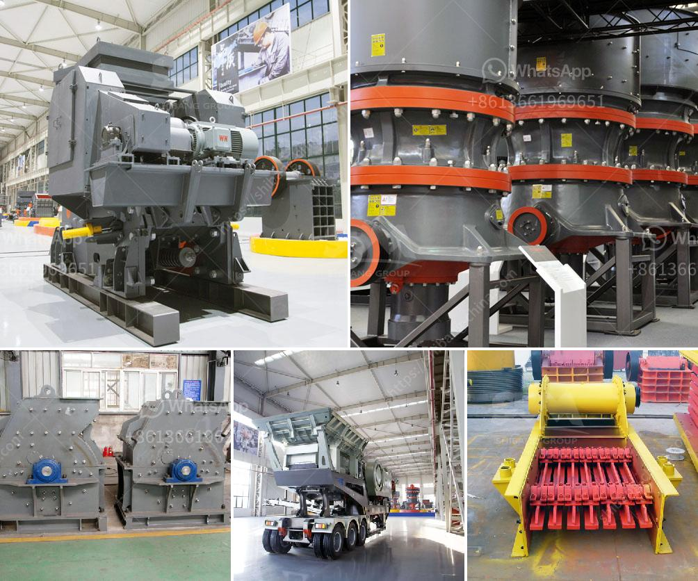

<h3>mini gold ore wash plant plans</h3>
The allure of gold has captivated people for centuries, and for good reason. The precious metal symbolizes wealth, prosperity, and the ultimate form of currency. In modern times, mining for gold has become a lucrative venture, with large-scale operations dominating the industry. However, small-scale mining has its place too, providing an opportunity for individuals and communities to thrive.

One of the main challenges faced by small-scale miners is the lack of access to advanced equipment and technologies. But fear not, as mini gold ore wash plant plans are here to level the playing field. These plans enable small-scale miners to extract gold from ore efficiently, effectively, and profitably.

So what exactly is a mini gold ore wash plant? It is a compact, self-contained washing unit that can be customized to meet the specific needs of small-scale miners. The plant consists of a vibrating screen, trommel, scrubber, and water supply system, all mounted on a portable chassis. The vibrating screen removes large rocks and debris, while the trommel separates fine particles from the coarse material. The scrubber ensures efficient cleaning of the ore, enhancing gold recovery rates. Finally, the water supply system supplies a constant flow of water for washing and processing.

What sets these mini plants apart is their portability and simplicity. They are designed to be easily transported to remote mining locations, allowing small-scale miners to explore new areas and tap into untapped gold reserves. The plants can be set up and operated by a small team, reducing the need for extensive manpower and minimizing operational costs. With a few adjustments and adaptations, these plans can be tailored to process different types of ores, making them versatile and adaptable.

The benefits of mini gold ore wash plant plans are manifold. Firstly, they enable small-scale miners to extract gold efficiently and with minimal environmental impact. The water supply system is designed to minimize water usage, promoting sustainability and responsible mining practices. Secondly, these plans provide a pathway to economic empowerment for individuals and communities. By harnessing the potential of small-scale mining, individuals can generate income and improve their standard of living.

Furthermore, mini gold ore wash plant plans have the potential to transform local economies. When small-scale miners thrive, they create a ripple effect that stimulates surrounding industries and businesses. Local suppliers of equipment and consumables, transportation services, and even tourism can benefit from the growth and success of small-scale mining operations. This, in turn, contributes to job creation and economic development in the region.

In conclusion, mini gold ore wash plant plans are revolutionizing small-scale mining. By providing access to advanced equipment and technologies, these plans unleash the potential of individuals and communities. They enhance gold recovery rates, promote sustainable practices, and contribute to economic empowerment. With their portability and adaptability, these plans unlock new possibilities for small-scale miners, allowing them to thrive in the competitive mining industry.
<h3>Contact us</h3><ul><li><strong>Whatsapp:&nbsp;<a href="https://wa.me/8613661969651">+8613661969651</a></strong></li><li><a href="https://swt.shibang-china.com/?git&amp;zhl&amp;mini gold ore wash plant plans"><strong>Online Service(chat now)</strong></a></li></ul><h3>Related</h3><ul><li><a href='laborte crusing plant.md'>laborte crusing plant</a></li><li><a href='price of stone crushing machine.md'>price of stone crushing machine</a></li><li><a href='used ultra fine wet grinding mill gold ore.md'>used ultra fine wet grinding mill gold ore</a></li><li><a href='alluvial gold plants for sale south africa.md'>alluvial gold plants for sale south africa</a></li><li><a href='roller crusher in egypt.md'>roller crusher in egypt</a></li></ul>