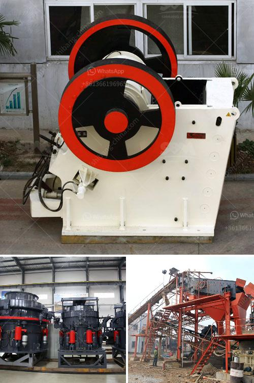

<h3>mini mobile crusher plant for sale</h3>
With the mining industry ever demanding better crushing capacities and durability, the market for mobile impact crushers is expanding rapidly. The sheer versatility of these crushers enables them to meet diverse crushing requirements. The most recent addition to the fleet is a new Mobile Mini Crusher, capable of crushing concrete, bricks, blocks, and more.

The crusher is designed to work alongside an existing static crusher, therefore allowing the existing production line to continue operating. It requires minimal site preparation, thus making it ideal for use in remote areas where the existing infrastructure is not well developed. Additionally, it can also be used as a standalone unit for construction projects or demolition applications.

One of the primary advantages of the mini mobile crusher plant is that it provides stone of a consistent quality and size. With a variety of outputs, it ensures that materials being processed are suitable for use in production. Furthermore, due to its compact design, it can be easily transported between sites, making it an efficient solution for contractors.

The mini mobile crusher plant for sale is designed with various machines, namely feeders, crushers, and conveyors, all in one trailer unit. They have an outstanding design for heavy-duty crushing and screening applications. The mining aggregate plant is built around the robust C106 jaw crusher, which has a proven track record in the toughest of applications.

It offers the best fuel efficiency in its class and optimized performance with an integrated control system. It is easy to operate with a wireless remote control for quick and efficient set-up and operation. The plant can be started or stopped with a single push button, enabling daily operations to get underway quickly.

The crusher on the mobile chassis offers a unique design that enables ease of transportation and simple maintenance. With excellent reliability and durability, the mini mobile crusher plant has been performing well.

In conclusion, the mini mobile crusher plant for sale is a comprehensive unit that integrates feeders, crushers, conveyors, and vibrating screens. It is suitable for crushing various minerals and rocks with compressive strengths ranging from 320 MPa to 2000 MPa. Moreover, it has a wide application scope, particularly for crushing hard rock, such as basalt, river pebbles, and so on. With its 300-500 tph capacity range, this mini mobile crusher plant is an ideal choice for processing large materials.
<h3>Contact us</h3><ul><li><strong>Whatsapp:&nbsp;<a href="https://wa.me/8613661969651">+8613661969651</a></strong></li><li><a href="https://swt.shibang-china.com/?git&amp;zhl&amp;mini mobile crusher plant for sale"><strong>Online Service(chat now)</strong></a></li></ul><h3>Related</h3><ul><li><a href='stone crusher machine in saudi arabia.md'>stone crusher machine in saudi arabia</a></li><li><a href='pf impact crusher.md'>pf impact crusher</a></li><li><a href='jaw crusher and spare parts.md'>jaw crusher and spare parts</a></li><li><a href='tons stationary impact granite crusher.md'>tons stationary impact granite crusher</a></li><li><a href='ecuador balls for crushing mill.md'>ecuador balls for crushing mill</a></li></ul>