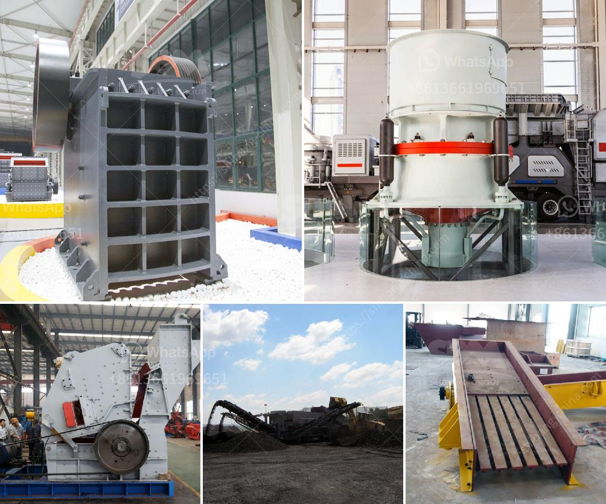

<h3>mining crusher costs</h3>
Mining, as an essential industry, plays a significant role in our global economy. However, the process of extracting valuable minerals from the Earth requires heavy machinery and equipment. One crucial piece of equipment used in this process is the mining crusher.

Mining crushers are machines used to break down large rocks into smaller, more manageable pieces for further processing. This equipment is vital for efficiently extracting minerals and materials from the ground. However, it's essential to consider the cost involved in purchasing and operating these crushers.

The cost of mining crushers can vary depending on several factors. One of the primary considerations is the size and capacity of the crusher. A larger crusher with a higher capacity will typically be more expensive than a smaller one. This is because larger crushers require more powerful motors and stronger materials to withstand the crushing process.

Another factor that affects the cost of mining crushers is the level of automation and technology incorporated into the machine. Advanced features and automation can improve efficiency and reduce downtime, but they also come at an additional cost. The level of automation required will depend on the specific mining operation and the desired output.

In addition to the initial purchase cost, it's also essential to consider the ongoing operating costs of mining crushers. These costs include energy consumption, maintenance, and replacement of worn parts. High-energy crushers can significantly impact energy consumption and, subsequently, operational costs. Similarly, crushers that require frequent maintenance and replacement parts may result in higher operating expenses.

To optimize the cost of mining crushers, it's important to strike a balance between initial investment and long-term operating costs. Conducting thorough research and selecting a crusher that best suits the specific mining operation's needs can help minimize costs in the long run.

In conclusion, the cost of mining crushers can significantly impact the profitability of a mining operation. Factors such as size, capacity, automation, and ongoing operating costs should be carefully evaluated when purchasing and operating these machines. By considering these factors, miners can make informed decisions and choose crushers that offer the best value for money while ensuring efficient and sustainable mineral extraction.
<h3>Contact us</h3><ul><li><strong>Whatsapp:&nbsp;<a href="https://wa.me/8613661969651">+8613661969651</a></strong></li><li><a href="https://swt.shibang-china.com/?git&amp;zhl&amp;mining crusher costs"><strong>Online Service(chat now)</strong></a></li></ul><h3>Related</h3><ul><li><a href='stones crushing machine in south africa for sale.md'>stones crushing machine in south africa for sale</a></li><li><a href='small rotary burner for sale used in us.md'>small rotary burner for sale used in us</a></li><li><a href='jaw crushers south africa.md'>jaw crushers south africa</a></li><li><a href='cost to set up mini cement plant in india.md'>cost to set up mini cement plant in india</a></li><li><a href='harga grinder mill.md'>harga grinder mill</a></li></ul>