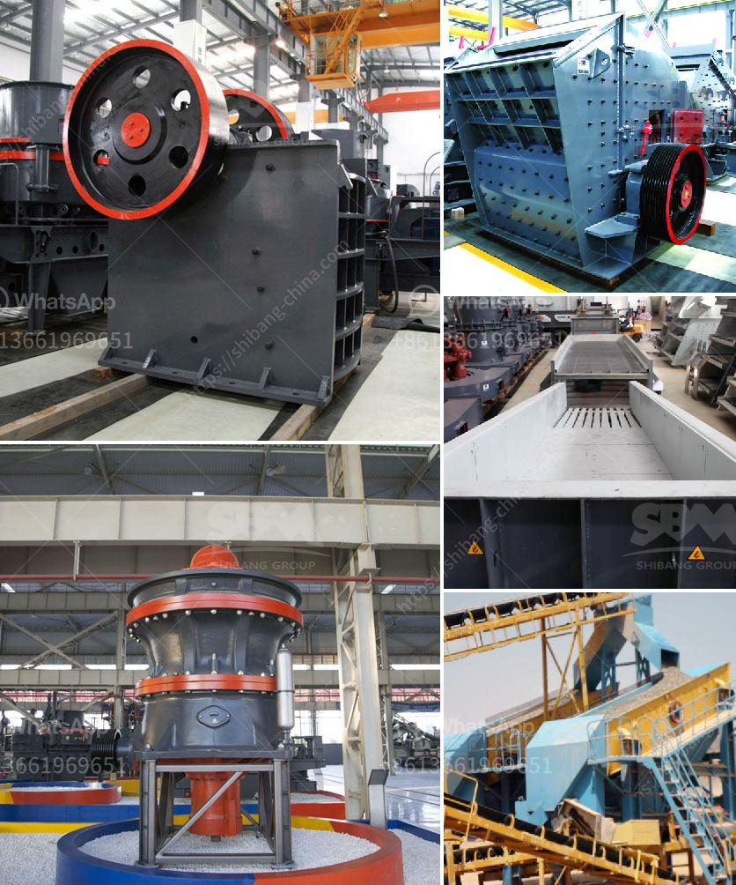

<h3>mining hammer crusher</h3>
Mining hammer crusher is a highly efficient machine that utilizes the impact of raw materials to reduce particle size. It is often used for hard rock crushing in quarries and mines, as well as for construction waste recycling, asphalt concrete, and cement manufacturing. In the mining industry, this crusher is an indispensable piece of equipment that can help you achieve the desired production goals.

The mining hammer crusher is composed of a rotor, a hammer head, and a counterattack liner. When the material enters the crushing cavity, it is impacted and crushed by the high-speed rotating hammerhead. The crushed material obtains kinetic energy and is thrown toward the counterattack liner at high speed, where further crushing occurs. This continuous process results in the desired particle size reduction.

What sets the mining hammer crusher apart from other crushing equipment is its simple structure, high production efficiency, low maintenance cost, and ability to perform in a wide range of applications. Its robust design ensures reliable operation even under harsh conditions, making it suitable for intensive mining operations.

Moreover, the mining hammer crusher offers a high degree of flexibility, allowing for easy adjustment of the gap between the hammerhead and the counterattack liner to control the particle size output. This enables operators to customize the final product according to specific requirements.

Additionally, the mining hammer crusher is designed with safety in mind. It is equipped with advanced safety devices, such as a hydraulic system to assist with the opening and closing of the housing and a self-locking device to prevent accidental opening. These features ensure the safety of operators and minimize the risk of accidents during operation.

In conclusion, the mining hammer crusher is an essential equipment in the mining industry. Its impressive performance, versatility, and safety features make it a powerful weapon for crushing hard rocks, recycling construction waste, and manufacturing cement. With its reliable operation and low maintenance cost, this crusher is a valuable asset for any mining operation seeking to maximize productivity and profitability.
<h3>Contact us</h3><ul><li><strong>Whatsapp:&nbsp;<a href="https://wa.me/8613661969651">+8613661969651</a></strong></li><li><a href="https://swt.shibang-china.com/?git&amp;zhl&amp;mining hammer crusher"><strong>Online Service(chat now)</strong></a></li></ul><h3>Related</h3><ul><li><a href='alluvial diamond processing plant cost.md'>alluvial diamond processing plant cost</a></li><li><a href='gold hammer mills for sale south africa.md'>gold hammer mills for sale south africa</a></li><li><a href='stone crusher machine supplier.md'>stone crusher machine supplier</a></li><li><a href='crushers in malaysia.md'>crushers in malaysia</a></li><li><a href='jaw crusher price 200mm.md'>jaw crusher price 200mm</a></li></ul>