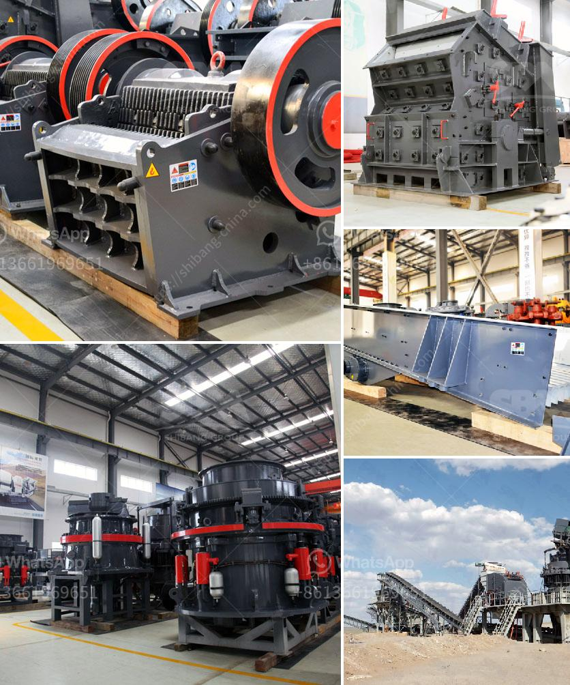

<h3>mining mining processing</h3>
Mining is a vital industry that plays a crucial role in the extraction of valuable minerals and resources from the earth's crust. The process of mining involves the removal of rocks, minerals, and other materials from underground or underwater deposits to obtain the desired substances for various industries.

Mining processing, also known as mineral processing, is the next step after mining. It involves the separation and concentration of valuable minerals from the extracted ore through several processes like crushing, grinding, and screening. This process is essential to maximize the value of the extracted minerals and ensure their proper utilization in different industries.

Crushing is the primary stage in the mining processing, where large chunks of ore are crushed into smaller pieces for further processing. This helps in increasing the surface area of ore particles, allowing for better extraction of valuable minerals during subsequent stages.

The next step is grinding, which involves the use of grinding mills to reduce the size of the ore particles even further. These mills use rotating drums and grinding media to break down the ore into finer particles. The finer the particles, the more efficient the extraction process becomes.

After grinding, the ore is subjected to a process called screening, where it is separated into different sizes based on their particle size. This helps in separating the valuable minerals from the waste materials present in the ore.

Once the minerals are separated, they undergo various concentration techniques to achieve a high-grade product. These techniques include froth flotation, magnetic separation, and gravity separation. Froth flotation utilizes chemical reagents to selectively separate valuable minerals from the unwanted gangue minerals, whereas magnetic separation uses magnets to separate magnetic minerals from non-magnetic ones. Gravity separation, on the other hand, relies on the difference in density between the minerals to separate them.

Mining processing is an essential part of the mining industry as it ensures the proper extraction and utilization of valuable minerals. It allows for the production of high-grade minerals that are used in various industries like construction, manufacturing, energy, and technology. The efficiency and effectiveness of mining processing techniques contribute to the sustainability and profitability of mining operations. Therefore, continuous research and technological advancements in mining processing are crucial for the industry's growth and success.
<h3>Contact us</h3><ul><li><strong>Whatsapp:&nbsp;<a href="https://wa.me/8613661969651">+8613661969651</a></strong></li><li><a href="https://swt.shibang-china.com/?git&amp;zhl&amp;mining mining processing"><strong>Online Service(chat now)</strong></a></li></ul><h3>Related</h3><ul><li><a href='cost of a conveyor belt in india.md'>cost of a conveyor belt in india</a></li><li><a href='list of gold refineries companies in uae.md'>list of gold refineries companies in uae</a></li><li><a href='different size mining cone crusher.md'>different size mining cone crusher</a></li><li><a href='micro fine grinding mill morrison.md'>micro fine grinding mill morrison</a></li><li><a href='alluvial diamond processing plant cost.md'>alluvial diamond processing plant cost</a></li></ul>