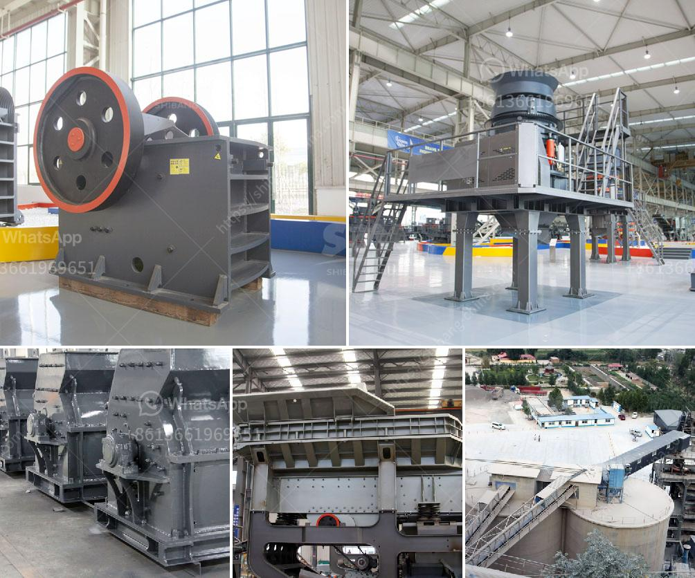

<h3>mining process of calcium carbonate in south africa</h3>
Calcium carbonate is a chemical compound found in rocks as the minerals calcite and aragonite. It is used in many industries, such as agriculture, pharmaceuticals, plastics, and environmental management. South Africa is one of the world's leading producers of calcium carbonate, and it supplies approximately 1.4 million tons of this mineral every year.

The process of mining calcium carbonate in South Africa entails locating and extracting the mineral deposits on the surface through various methods. Surface mining and underground mining are the two major types of mining operations performed to extract calcium carbonate. The mining techniques chosen depend on the depth of the deposit and the environmental impact assessment.

Surface mining is the most common method used for calcium carbonate mining in South Africa. This method involves removing the topsoil and overburden material to access the calcium carbonate deposits. In open-pit mining, blasting and drilling are commonly used to extract the mineral. Once the calcium carbonate is extracted, it is transported to a nearby processing plant for further refining.

However, in some areas, calcium carbonate deposits are found deep underground. In such cases, underground mining techniques are employed. Underground mining involves constructing tunnels and shafts to access the mineral deposits. Heavy machinery and specialized equipment are used to extract and transport the calcium carbonate to the surface.

Once the calcium carbonate is extracted from the mines, it undergoes several processing stages to obtain the desired product. First, the ore is crushed and ground into a fine powder. The powder is then subjected to various chemical processes, such as flotation and acid leaching, to remove impurities and improve the purity of the calcium carbonate.

After the initial processing, the calcium carbonate is further refined and processed into different grades or forms, depending on its intended use. Precipitated calcium carbonate (PCC) and ground calcium carbonate (GCC) are the two most common forms produced. PCC is widely used in the paper, paint, and plastics industries, while GCC is used in the construction, agriculture, and pharmaceutical sectors.

South Africa's calcium carbonate mining industry plays a significant role in the country's economy. It provides employment opportunities for thousands of individuals and contributes to the local and national GDP. The mining process also requires the use of various supporting services and infrastructure, further boosting economic growth.

However, like any mining operation, calcium carbonate mining presents environmental challenges. The removal of topsoil and the extraction of the mineral can disrupt habitats and cause soil erosion. To mitigate these impacts, strict environmental regulations and rehabilitation plans are put in place to ensure responsible mining practices.

In conclusion, the mining process of calcium carbonate in South Africa involves the extraction of the mineral from surface or underground deposits through blasting, drilling, and specialized machinery. It is then refined and processed into different forms for use in various industries. While providing economic benefits, it is crucial to ensure responsible mining practices to minimize environmental impacts.
<h3>Contact us</h3><ul><li><strong>Whatsapp:&nbsp;<a href="https://wa.me/8613661969651">+8613661969651</a></strong></li><li><a href="https://swt.shibang-china.com/?git&amp;zhl&amp;mining process of calcium carbonate in south africa"><strong>Online Service(chat now)</strong></a></li></ul><h3>Related</h3><ul><li><a href='gold mining equipment stamp mill.md'>gold mining equipment stamp mill</a></li><li><a href='calcite powder manufacturer machines.md'>calcite powder manufacturer machines</a></li><li><a href='mobile crusher italy.md'>mobile crusher italy</a></li><li><a href='feasibility study for the establishment of quarry.md'>feasibility study for the establishment of quarry</a></li><li><a href='small crushing machines for gold.md'>small crushing machines for gold</a></li></ul>