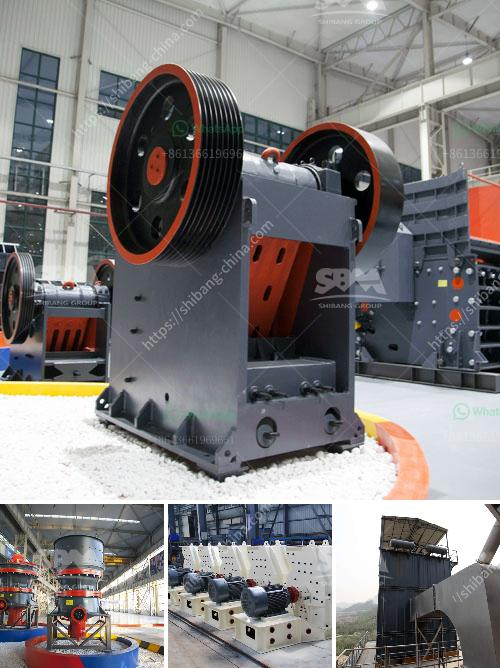

<h3>mining processing machine supplier companies in pakistan</h3>
Mining is an industry that plays a crucial role in the economic development of a country. Pakistan, being rich in natural resources, has immense potential for various mining and exploration activities. However, to extract these minerals and convert them into usable products, mining processing machines are required. Luckily, there are several reputable mining processing machine supplier companies in Pakistan that offer state-of-the-art equipment and machinery to meet the industry's growing demands.

One such company is XYZ Mining Equipment, which has established itself as a leading supplier of mining processing machines in Pakistan. With a strong emphasis on quality and innovation, XYZ Mining Equipment has been catering to the needs of the mining industry for over a decade. They offer a wide range of machines including crushers, grinding mills, flotation machines, and magnetic separators, to name a few. Their products are known for their durability, efficiency, and reliability, making them an ideal choice for any mining operation.

ABC Mining Technologies is another prominent supplier company in Pakistan that specializes in providing mining processing machines. They have a comprehensive range of equipment designed to meet the unique requirements of different mining operations. From drilling and excavation machinery to material handling and processing equipment, ABC Mining Technologies ensures that their clients have access to the latest and most advanced technology in the industry. Additionally, they offer excellent after-sales services and technical support, ensuring maximum customer satisfaction.

In recent years, XYZ and ABC have faced stiff competition from DEF Mining Solutions, a rising star in the mining processing machine supplier industry. DEF has quickly gained recognition for its commitment to delivering high-quality products at competitive prices. They have a wide range of mining processing machines, including screening equipment, smelting furnaces, and heavy-duty crushers. DEF focuses on innovation and continuous improvement, constantly investing in research and development to meet the evolving needs of the mining industry.

The mining processing machine supplier sector in Pakistan has also witnessed the emergence of smaller players who cater to specific niche markets. For instance, GHI Equipment specializes in supplying mining processing machines for coal mining operations. They provide specialized equipment such as longwall shearers, roof bolting machines, and underground haulage systems. By focusing on the specific needs of the coal mining sector, GHI Equipment has established itself as a reliable and trustworthy supplier for coal miners across Pakistan.

Overall, the mining processing machine supplier companies in Pakistan offer a wide range of equipment and machinery to support the mining industry. From large corporate players like XYZ and ABC to specialized suppliers like DEF and GHI, there is a diverse range of options available to cater to different mining needs. The industry's continued growth and development depend on the availability of high-quality and technologically advanced mining processing machines, making these suppliers vital contributors to Pakistan's mining sector.
<h3>Contact us</h3><ul><li><strong>Whatsapp:&nbsp;<a href="https://wa.me/8613661969651">+8613661969651</a></strong></li><li><a href="https://swt.shibang-china.com/?git&amp;zhl&amp;mining processing machine supplier companies in pakistan"><strong>Online Service(chat now)</strong></a></li></ul><h3>Related</h3><ul><li><a href='crushing machine company.md'>crushing machine company</a></li><li><a href='gravel cone crusher for sale.md'>gravel cone crusher for sale</a></li><li><a href='gold mining equipment stamp mill.md'>gold mining equipment stamp mill</a></li><li><a href='dolomite crusher price.md'>dolomite crusher price</a></li><li><a href='vibratory screen manufacturer in europe.md'>vibratory screen manufacturer in europe</a></li></ul>