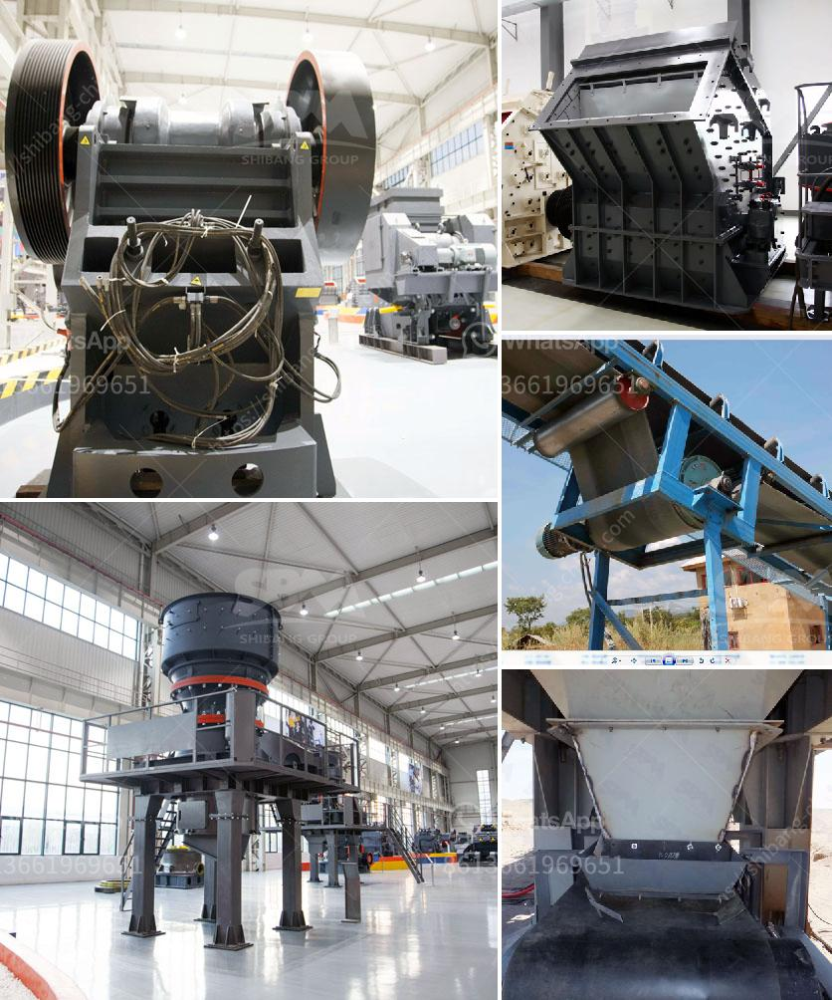

<h3>mobile and modular coal washing plants</h3>
With the increasing demand for coal as a source of energy, it has become imperative to optimize the coal cleaning process to improve its quality and reduce the environmental impact. In recent years, mobile and modular coal washing plants have emerged as a viable solution to meet these challenges. These innovative plants offer enhanced efficiency, flexibility, and sustainability, making them an attractive choice for coal producers worldwide.

Traditional coal washing plants are typically built as fixed installations at a particular mining site. However, mobile and modular plants have revolutionized the industry by introducing the concept of portability and adaptability. These plants are designed to be easily transported and installed at different mining locations, bringing the cleaning capabilities closer to the source of coal production. This eliminates the need for long-distance transportation of raw coal, reducing associated costs and carbon emissions.

The modular nature of these plants allows for rapid assembly and disassembly, enabling quick deployment and relocation. This flexibility is particularly advantageous for coal producers operating in multiple mining sites or regions. By transferring the washing plant from one site to another, they can maximize the utilization of their equipment and optimize coal cleaning processes.

Mobile and modular coal washing plants are equipped with advanced technologies that facilitate efficient cleaning of coal, resulting in improved quality and reduced impurities. These plants incorporate processes such as dense medium separation, froth flotation, and fine coal centrifuges to achieve effective coal cleaning. The integration of automated systems and sensors further enhances operational efficiency, minimizing human error and maximizing productivity.

In addition to enhancing efficiency, mobile and modular coal washing plants contribute to sustainability by reducing the environmental footprint of coal production. The cleaning processes employed in these plants remove various impurities, including sulfur, ash, and heavy metals, minimizing their release into the atmosphere and water bodies. High-quality coal produced from these plants results in lower emissions when used for power generation, contributing to cleaner air and a healthier environment.

The application of mobile and modular coal washing plants is not limited to large-scale mining operations alone. Small and medium-sized coal producers can also benefit from these plants, as they offer a cost-effective solution that enhances the marketability of their coal. By improving coal quality, these plants increase the value proposition of the produced coal, attracting more buyers and potentially higher prices.

Furthermore, mobile and modular coal washing plants can play a crucial role in rehabilitating abandoned or underutilized coal mines. These plants can be deployed to extract and clean coal from these sites, ensuring that valuable resources are not wasted while restoring the land for other uses. This approach promotes a circular economy and sustainable land management practices, benefiting both the environment and local communities.

In conclusion, mobile and modular coal washing plants have emerged as a game-changer in the coal industry. Their portability, flexibility, and advanced cleaning technologies make them a sustainable solution for improving coal quality and reducing environmental impact. With their adaptability and efficiency, these plants are poised to transform coal production practices worldwide, promoting a cleaner and sustainable future.
<h3>Contact us</h3><ul><li><strong>Whatsapp:&nbsp;<a href="https://wa.me/8613661969651">+8613661969651</a></strong></li><li><a href="https://swt.shibang-china.com/?git&amp;zhl&amp;mobile and modular coal washing plants"><strong>Online Service(chat now)</strong></a></li></ul><h3>Related</h3><ul><li><a href='grinding mill machine cost price south africa.md'>grinding mill machine cost price south africa</a></li><li><a href='coal grinding mill in bhopal india.md'>coal grinding mill in bhopal india</a></li><li><a href='stone crushers in china.md'>stone crushers in china</a></li><li><a href='lime stone screw conveyor.md'>lime stone screw conveyor</a></li><li><a href='impactor crusher for sale south africa price.md'>impactor crusher for sale south africa price</a></li></ul>