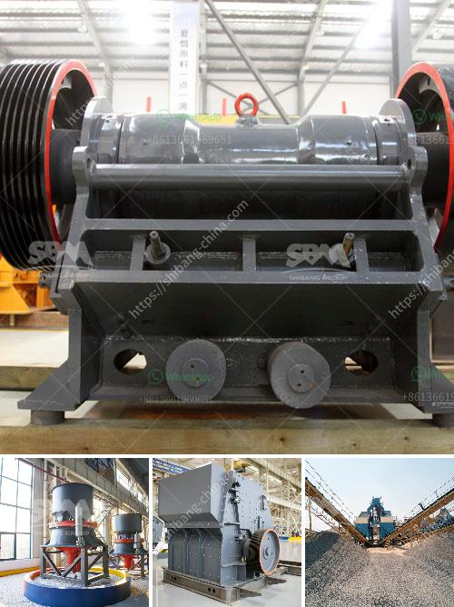

<h3>mobile chrome crusher suppliers in south africa</h3>
Mobile chrome crusher suppliers in South Africa are a professional production of stone crushing machine.Mobile chrome crusher suppliers in South Africa Sales and Widely used in Europe, South America, Africa, East Asia and Asia region. Stone Crusher Machine.

XSM production of stone crusher: jaw crusher, impact crusher, cone crusher, hammer crusher and mobile crusher, stone crusher is mainly applied to soft or hard and extremely hard materialscrushing, plastic, widely used in various ores, cement, refractories, aluminum where the soil clinker, carborundum, glass raw materials, mechanism building sand, stone and a variety of metallurgical slag. In South Africa, Mobile Chrome Crusher Machine Manufacturer XSM production as well as sales of mining crushing equipment, sand making equipment and associated ancillary equipment.

Chrome processing plants in South Africa have been developed to simplify the beneficiation process. It is important to introduce the various types of mobile chrome crusher plants and their respective specifications: (1) In South Africa, the mobile chrome crusher can produce the chrome sand, it is mainly divided into two types: one is fixed type, the other is the portable type. The device can directly get chrome ore, crushed into gravel. In this production line, there is a mobile jaw crusher, which is convenient and suitable for crushing chrome ore. (2) In South Africa, the mobile chrome crusher can be equipped with jaw crusher, impact crusher, cone crusher, etc. for further crushing. The mobile crusher can also finely crush the sandstone, quartzite, limestone, etc., which are applied to the industry of refractory material, ceramic, inorganic fertilizer, glass, coating, etc.Many people think that the mobile crusher can make a small sand factory more profitable. However, this is not the case. Some small manufacturers will choose to invest in fixed mobile equipment after the profit is stable. Because the fixed mobile crusher has a high equipment investment, low efficiency, but high investment producer will have a better return.

In conclusion, mobile chrome crushers can meet the requirements of environmental protection and has the characteristics of modernization. With the rapid development of infrastructure, the mobile crusher has huge market potential. Currently, many mobile chrome crushers purchasing orders are from South Africa. If you want to invest in this project, please contact us, we will give you best choice. Mobile Chrome Crusher Supplier in South Africa.
<h3>Contact us</h3><ul><li><strong>Whatsapp:&nbsp;<a href="https://wa.me/8613661969651">+8613661969651</a></strong></li><li><a href="https://swt.shibang-china.com/?git&amp;zhl&amp;mobile chrome crusher suppliers in south africa"><strong>Online Service(chat now)</strong></a></li></ul><h3>Related</h3><ul><li><a href='business plan on manganese ore mining.md'>business plan on manganese ore mining</a></li><li><a href='vibrating screens manufacturers india.md'>vibrating screens manufacturers india</a></li><li><a href='how to measure output of a crusher plant.md'>how to measure output of a crusher plant</a></li><li><a href='rubber mill grinder.md'>rubber mill grinder</a></li><li><a href='mining hammer crusher.md'>mining hammer crusher</a></li></ul>