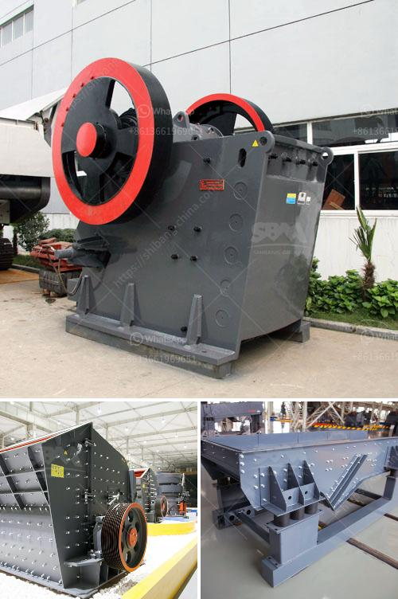

<h3>mobile coal jaw crusher for hire</h3>
Mobile coal jaw crusher for hire is one of the most popular equipment in the mining industry. It is specifically designed for the coal and stone industry to crush coal and large pieces of stone into smaller pieces. This machine is equipped with a solid and robust engine that has the capacity to accelerate the crushing process.

The mobile coal jaw crusher for hire is known for its exceptional performance in both high capacity contracting jobs and for converting demolition waste into reusable materials. It is ideal for flexible recycling applications with asphalt, concrete, and demolition debris. Furthermore it is equipped with a heavy-duty jaw crusher which ensures high capacity and high reduction ratios.

The powerful mobile coal jaw crusher is capable of handling the most demanding tasks and is ideal for processing materials such as iron ore, coal, gravels, etc. The portable rock crusher is designed to crush large pieces of rock, making it ideal for metal and non-metal ore, and industrial mineral processing applications.

When the rock crusher operates at a high-speed setting, it easily grinds the rocks into small pieces. The pulverizer quickly processes the rocks and turns them into fine powder, which can be used in construction, land fertilization, and aggregates. The mobile coal jaw crusher can crush particles up to 200mm, with a crushing range of 10mm to 100mm.

It can easily crush coal blocks between 50 and 70mm to coal dust in a matter of seconds. The mobile coal jaw crusher has a generator, and the connected electrical equipment powers the power supply, which is stored in a battery pack. The generator generates electricity to power the super-large-sized mobile coal jaw crusher.

The crusher system is powered by an external diesel engine. The mobile coal jaw crusher processes coal by crushing it into small and tiny particles for use in various applications. The mobile coal crusher achieves breakthrough innovations in various aspects of coal crushing.

The mobile coal jaw crusher's innovative features solve the problem of the complex terrain of the production site, reduce the cost of material transportation, and improve the working efficiency. The environmental protection and energy-saving mobile coal jaw crusher not only reduces dust and noise pollution, but also reflects the concept of low-carbon development.

In conclusion, the mobile coal jaw crusher for hire is definitely a reliable, high-efficiency, energy-saving, and environmentally friendly crushing equipment. It is in line with the current market demand and can replace traditional coal jaw crusher for hire in many fields and industries. With the strong support of the government, high-quality and cost-effective mobile coal jaw crushers are available for hire at any time.
<h3>Contact us</h3><ul><li><strong>Whatsapp:&nbsp;<a href="https://wa.me/8613661969651">+8613661969651</a></strong></li><li><a href="https://swt.shibang-china.com/?git&amp;zhl&amp;mobile coal jaw crusher for hire"><strong>Online Service(chat now)</strong></a></li></ul><h3>Related</h3><ul><li><a href='rubber conveyor belt manufacturers in turkey.md'>rubber conveyor belt manufacturers in turkey</a></li><li><a href='simple diagram for high energy ball milling.md'>simple diagram for high energy ball milling</a></li><li><a href='sell conveyor belts in south africa.md'>sell conveyor belts in south africa</a></li><li><a href='mobile crushers manufactureres in china.md'>mobile crushers manufactureres in china</a></li><li><a href='ultra fine grinding mill for limestone.md'>ultra fine grinding mill for limestone</a></li></ul>