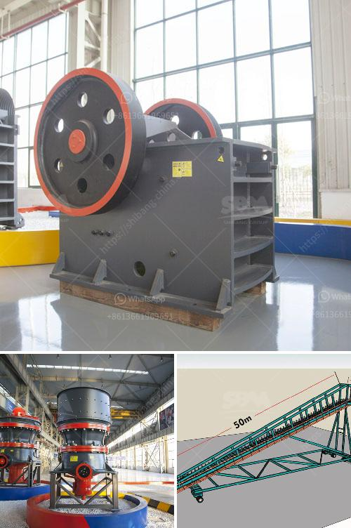

<h3>mobile coal washing plant investment</h3>
Mobile coal washing plants are becoming increasingly popular due to their ability to wash coal in remote locations. These plants offer a more cost-effective solution for coal producers, as they eliminate the need for transportation to a fixed washing plant. With the investment in a mobile coal washing plant, companies can reduce transportation costs, increase operational efficiency, and improve environmental sustainability.

One of the primary advantages of a mobile coal washing plant is its flexibility. It can be easily transported to different mining sites, allowing coal producers to wash coal directly where it is extracted. This eliminates the need for long-distance transportation, which can be expensive and time-consuming. Moreover, by washing coal immediately after extraction, companies can reduce the loss of coal fines, resulting in higher overall coal recovery rates.

Another significant advantage of investing in a mobile coal washing plant is its ability to improve coal quality. The washing process removes impurities, such as ash and sulfur, from the coal, resulting in a higher calorific value and reduced emissions when burnt. This, in turn, helps coal producers meet stringent environmental regulations and enhance the marketability of their coal.

Furthermore, mobile coal washing plants offer significant operational efficiency gains. These plants are equipped with advanced technologies that enable automated and continuous washing processes. Operators can monitor and control the plant remotely, reducing the need for manual intervention. This not only enhances worker safety but also increases the overall plant productivity and reduces the downtime for maintenance and repairs.

Lastly, investing in a mobile coal washing plant can have positive environmental impacts. The washing process can reduce the release of harmful pollutants, such as sulfur dioxide and particulate matter, into the atmosphere. This helps coal producers to meet emission standards and contribute towards a cleaner and greener environment.

In conclusion, investing in a mobile coal washing plant offers numerous benefits for coal producers. Whether it is reducing transportation costs, improving coal quality, enhancing operational efficiency, or promoting environmental sustainability, these plants have a significant positive impact. As the demand for high-quality coal continues to grow, mobile coal washing plants provide a cost-effective and efficient solution for coal producers worldwide.
<h3>Contact us</h3><ul><li><strong>Whatsapp:&nbsp;<a href="https://wa.me/8613661969651">+8613661969651</a></strong></li><li><a href="https://swt.shibang-china.com/?git&amp;zhl&amp;mobile coal washing plant investment"><strong>Online Service(chat now)</strong></a></li></ul><h3>Related</h3><ul><li><a href='vertical grinding machine for marble.md'>vertical grinding machine for marble</a></li><li><a href='graphite mining process.md'>graphite mining process</a></li><li><a href='silver copper cone crusher.md'>silver copper cone crusher</a></li><li><a href='stone dust processing machine.md'>stone dust processing machine</a></li><li><a href='list of mini cement plants in gujarat.md'>list of mini cement plants in gujarat</a></li></ul>