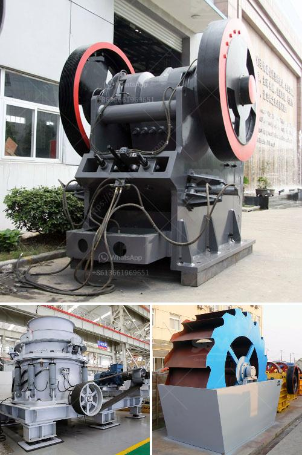

<h3>mobile concrete crusher uk prices</h3>
In the construction industry, efficiency and cost-effectiveness play a crucial role in achieving project success. One innovative solution that has proven to be a game-changer in the field is the mobile concrete crusher. This versatile equipment allows contractors to recycle and reuse concrete waste, reducing the environmental impact of construction projects while also cutting down on expenses. In the UK, a wide range of mobile concrete crushers are available at various prices, offering contractors a cost-effective solution that meets their specific needs.

One of the key advantages of mobile concrete crushers is that they can be easily transported to the project site. These crushers are typically mounted on tracks, allowing them to navigate through rough terrains and access even the most remote locations. This mobility eliminates the need for transporting large amounts of concrete waste to a recycling facility, significantly reducing transportation costs and carbon emissions.

When it comes to pricing, mobile concrete crushers in the UK vary depending on their capacity and usage. Smaller crushers with a capacity of around 5-10 tons per hour can be found at a starting price of around £25,000, while larger crushers with capacities exceeding 100 tons per hour can reach prices of over £200,000. It's worth noting that prices are also influenced by factors such as manufacturer reputation, additional features, and overall build quality. Investing in a reliable crusher from a reputable manufacturer may come with a higher price tag but can offer long-term cost savings through improved efficiency and durability.

Aside from the initial investment, it is essential to consider the operational costs associated with using a mobile concrete crusher. One significant cost-saving advantage of these crushers is that they can be powered either by diesel fuel or electricity. Diesel-powered crushers are suitable for sites without access to electrical power, while those with an electricity supply can benefit from lower fuel costs and reduced carbon emissions. It is crucial to analyze the availability and cost of fuel or electricity at the project site to determine the most cost-effective crusher option.

Furthermore, mobile concrete crushers offer an efficient solution for recycling existing concrete waste, which can be used as a substitute for natural aggregates. By recycling concrete waste, contractors can reduce the need for raw materials mining and contribute to a more sustainable construction industry. This not only reduces the environmental impact of construction projects but can also help companies meet sustainability targets and enhance their reputation.

In conclusion, mobile concrete crushers in the UK provide contractors with an efficient and cost-effective solution for recycling concrete waste on-site. These versatile machines offer mobility and compatibility with various power sources, enabling contractors to access remote locations and reduce transportation costs. While prices vary depending on the crusher's capacity and features, investing in a reliable crusher from a reputable manufacturer can lead to long-term cost savings. Additionally, recycling concrete waste contributes to the sustainability of construction projects and helps companies meet environmental targets. With the numerous benefits they offer, mobile concrete crushers are becoming an increasingly popular choice for construction projects in the UK.
<h3>Contact us</h3><ul><li><strong>Whatsapp:&nbsp;<a href="https://wa.me/8613661969651">+8613661969651</a></strong></li><li><a href="https://swt.shibang-china.com/?git&amp;zhl&amp;mobile concrete crusher uk prices"><strong>Online Service(chat now)</strong></a></li></ul><h3>Related</h3><ul><li><a href='gold mining equipment for sale in singapore.md'>gold mining equipment for sale in singapore</a></li><li><a href='used iron ore equipment for sale.md'>used iron ore equipment for sale</a></li><li><a href='calcite crusher machine.md'>calcite crusher machine</a></li><li><a href='list of gold refineries companies in uae.md'>list of gold refineries companies in uae</a></li><li><a href='stone crusher machine in kenya.md'>stone crusher machine in kenya</a></li></ul>