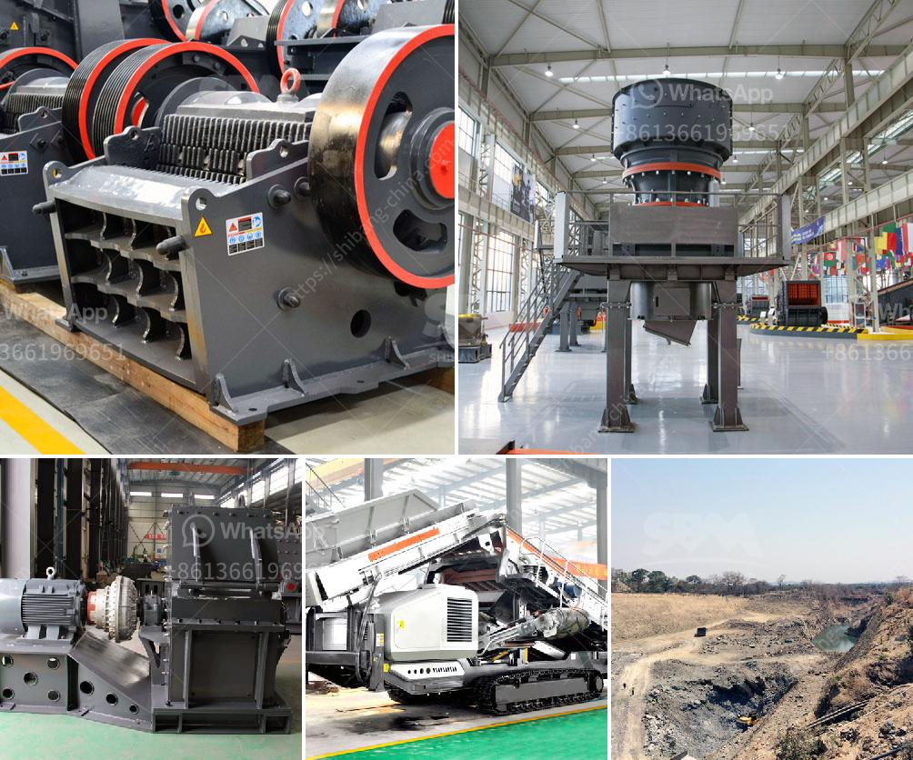

<h3>mobile concrete crusher</h3>
Mobile concrete crusher is a type of high-efficiency crushing equipment suitable for urban construction waste treatment and other industries. It has the characteristics of simple structure, compact layout, high crushing efficiency, low noise and reliable operation. The mobile concrete crusher is a combination of various crushers to process construction waste into specific aggregate sizes, with a production capacity of 30-800 tons per hour.

The equipment can be set up at any construction site, whether it is a demolition site or a construction site that needs to apply crushing operations. It can effectively crush construction waste, transforming it into recycled aggregates that can be used as raw materials for new constructions. This not only reduces the impact on the environment caused by construction waste but also effectively utilizes resources.

One of the remarkable features of mobile concrete crushers is their flexibility. They can be easily transported from one location to another, which significantly reduces transportation costs and allows for on-site crushing. This flexibility also enables the equipment to be used in various applications, such as road and bridge construction, urban infrastructure construction, metallurgy, and energy industries.

Another advantage of mobile concrete crushers is their ability to process a wide range of materials. They can handle various types of construction waste, such as concrete, bricks, asphalt, and demolition waste, as well as natural rocks like limestone, river pebbles, and granite. This versatility makes the equipment suitable for different project requirements and ensures efficient recycling processes.

Mobile concrete crushers are equipped with advanced safety features to ensure the protection of operators and the surrounding environment. They are usually equipped with a safety guard, emergency stop buttons, and a dust suppression system. These safety features help operators avoid accidents, protect their health, and minimize dust emissions, making them ideal for urban construction projects.

In addition to the above advantages, mobile concrete crushers also have economic benefits. The recycling of construction waste reduces the need for raw materials, which lowers procurement costs. Recycled aggregates are often cheaper than natural aggregates, making them an attractive option for construction projects. Moreover, the use of mobile concrete crushers can also generate additional income by selling recycled materials to other construction companies or using them in new construction projects.

In summary, the mobile concrete crusher is an efficient and cost-effective crushing equipment that is flexible, reliable, and safe to use. It allows the recycling of construction waste and generates recycled aggregates that can be used in various construction applications. With the increasing emphasis on environmental protection and resource utilization, the mobile concrete crusher is becoming an indispensable tool for sustainable urban development.
<h3>Contact us</h3><ul><li><strong>Whatsapp:&nbsp;<a href="https://wa.me/8613661969651">+8613661969651</a></strong></li><li><a href="https://swt.shibang-china.com/?git&amp;zhl&amp;mobile concrete crusher"><strong>Online Service(chat now)</strong></a></li></ul><h3>Related</h3><ul><li><a href='stone crusher conveyors belt price.md'>stone crusher conveyors belt price</a></li><li><a href='limestone crusher machine limus.md'>limestone crusher machine limus</a></li><li><a href='used mobile crushing plant trailer.md'>used mobile crushing plant trailer</a></li><li><a href='jaw crusher and spare parts.md'>jaw crusher and spare parts</a></li><li><a href='hydro classifier silica sand.md'>hydro classifier silica sand</a></li></ul>