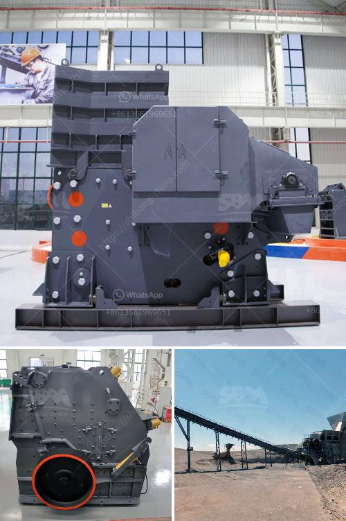

<h3>mobile crusher - china</h3>
The mobile crusher has revolutionized the way we mine and quarry materials by providing an efficient, dependable solution for challenging tasks. Gone are the days of hauling stones and rocks manually from the quarry to the construction site. Now, with the help of a mobile crusher, you can easily crush and transport materials on-site, saving time and money.

China, being one of the leading players in the global mining industry, has recognized the importance of mobile crushers in streamlining mining operations. Chinese manufacturers have designed and developed various models of mobile crushers to cater to different needs and requirements.

One such mobile crusher from China that has gained popularity worldwide is the 100-300tph mobile crusher. It offers the flexibility and mobility needed to accommodate a variety of applications, whether it be for quarrying, recycling, or mining operations. With a robust construction and powerful engine, this mobile crusher can handle even the toughest materials, including rocks, concrete, and asphalt.

Moreover, the 100-300tph mobile crusher from China is equipped with advanced features to enhance productivity and efficiency. It comes with a remote control system that allows operators to conveniently maneuver the machine, adjusting the crusher settings and monitoring the production process from a safe distance. Additionally, it is equipped with a vibrating feeder that ensures a consistent flow of materials into the crusher, thereby optimizing performance.

Safety is also a top priority when it comes to mobile crushers from China. These machines are designed with safety features such as emergency stop buttons, safety guards, and sensors to prevent accidents and ensure the well-being of operators.

In conclusion, the mobile crusher from China is a game-changer for the mining industry. Its versatility, mobility, and efficiency make it an ideal choice for mining companies seeking to streamline their operations and improve productivity. With its advanced features and robust construction, the 100-300tph mobile crusher from China is a reliable and cost-effective solution for all your crushing needs. Whether you are quarrying, recycling, or mining, this mobile crusher is sure to deliver exceptional performance.
<h3>Contact us</h3><ul><li><strong>Whatsapp:&nbsp;<a href="https://wa.me/8613661969651">+8613661969651</a></strong></li><li><a href="https://swt.shibang-china.com/?git&amp;zhl&amp;mobile crusher  china"><strong>Online Service(chat now)</strong></a></li></ul><h3>Related</h3><ul><li><a href='cost per hour mobile crusher.md'>cost per hour mobile crusher</a></li><li><a href='three roll mills supplier.md'>three roll mills supplier</a></li><li><a href='best prices for portable impact crushers.md'>best prices for portable impact crushers</a></li><li><a href='starting of ball mill with vfd.md'>starting of ball mill with vfd</a></li><li><a href='production process of cement.md'>production process of cement</a></li></ul>