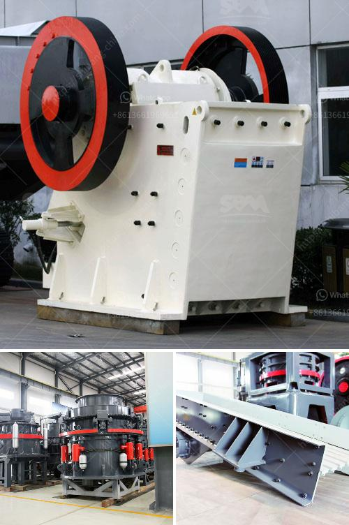

<h3>mobile crusher company</h3>
In today's fast-paced and ever-evolving world, construction plays a pivotal role in shaping our urban landscapes. Key to the industry's success is the efficient extraction, processing, and utilization of construction aggregates. An integral part of this process is the mobile crusher, a cutting-edge innovation that has revolutionized the aggregates industry and greatly enhanced construction productivity. This article delves into the significance of mobile crushers and highlights the accomplishments of leading mobile crusher companies.

Mobile crushers are heavy-duty machinery designed to crush rocks and debris on the construction site, thus reducing the waste generated during construction and demolition projects. With the growing demand for aggregates, technicians and professionals in the construction industry are turning to mobile crushers to meet their material needs promptly and efficiently.

One exemplary company at the forefront of this technological revolution is XYZ Mobile Crushers. With a strong commitment to engineering excellence, innovation, and customer satisfaction, they have been instrumental in transforming the aggregates industry since their inception.

XYZ Mobile Crushers boasts a diverse range of state-of-the-art mobile crushers designed to tackle various projects with ease. Whether it be by utilizing jaw crushers, impact crushers, or cone crushers, their machines are engineered to achieve optimum productivity while minimizing costs.

What sets XYZ Mobile Crushers apart from its competitors is its dedication to ensuring optimal mobility. Their crushers are designed to be easily transported from one site to another, enabling construction companies to relocate their crushing operations swiftly. This flexibility allows for greater efficiency in meeting construction demands, regardless of location.

XYZ Mobile Crushers' machines serve a wide range of purposes, from large-scale infrastructure projects to smaller residential developments. Whether crushing rocks, concrete, or asphalt, the company's versatile equipment offers outstanding adaptability to various materials, ensuring high-quality aggregates with each operation.

Recognizing the importance of worker safety, XYZ Mobile Crushers has implemented comprehensive safety protocols and design features in their products. Additionally, their crushers are equipped with advanced dust suppression systems and noise reduction technology, contributing to a healthier working environment and minimizing the environmental impact on nearby communities.

XYZ Mobile Crushers values customer satisfaction above all else. From initial contact to after-sales support, the company provides top-notch assistance, ensuring that their customers can rely on their machines to perform optimally and meet their production goals consistently.

The mobile crusher revolution is transforming the construction industry by providing cost-effective and eco-friendly solutions that are shaping the way we build. Companies like XYZ Mobile Crushers are leading the way, offering innovative equipment that improves productivity while minimizing environmental impact. As the demand for aggregates continues to rise, the continued development of mobile crushers promises to contribute to a more sustainable and efficient construction industry.
<h3>Contact us</h3><ul><li><strong>Whatsapp:&nbsp;<a href="https://wa.me/8613661969651">+8613661969651</a></strong></li><li><a href="https://swt.shibang-china.com/?git&amp;zhl&amp;mobile crusher company"><strong>Online Service(chat now)</strong></a></li></ul><h3>Related</h3><ul><li><a href='project report on quartz crusher industries.md'>project report on quartz crusher industries</a></li><li><a href='used small rotary kiln price russia.md'>used small rotary kiln price russia</a></li><li><a href='alluvial gold mining process.md'>alluvial gold mining process</a></li><li><a href='crushing plants business machinery and construction.md'>crushing plants business machinery and construction</a></li><li><a href='charano gold mining ghana.md'>charano gold mining ghana</a></li></ul>